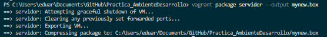
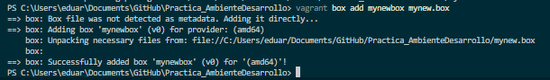
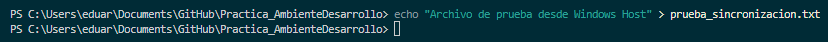
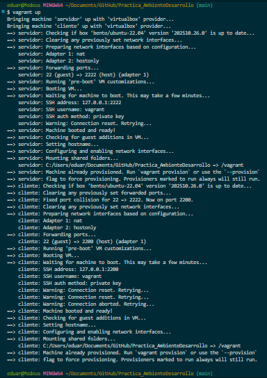
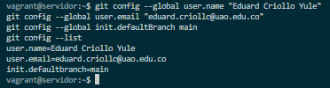
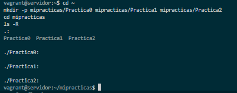

# Práctica: Configuración de Entorno Virtualizado con Vagrant

**Asignatura / Curso:** Ambiente de Desarrollo  
**Profesor:** Prof. Oscar Mondragón  
**Estudiante:** Eduard Criollo Yule  
**Correo:** `eduard.criollo@uao.edu.co`  
**Repositorio:** `Practica_AmbienteDesarrollo`  
**Estado del Proyecto:** ✅ Práctica completada e integrada con evidencias de laboratorio en el informe.

---

## 📑 Resumen Ejecutivo

Este documento constituye el **informe final, constatación y archivo de sustentación técnica** correspondiente a la práctica sobre **Configuración de Entorno Virtualizado con Vagrant, VirtualBox, Ubuntu y Git**. Contiene la documentación técnica paso a paso, el análisis conceptual a profundidad y la evidencia fotográfica (capturas de pantalla) de la ejecución de comandos, despliegue de infraestructura, pruebas de conectividad de red, empaquetamiento de máquinas virtuales, directorios sincronizados y gestión de repositorios con Git y GitHub.

---

## 🛠️ 1. Infraestructura y Configuración del Entorno (Secciones 1 - 5)

La arquitectura desplegada consiste en un modelo **Cliente-Servidor** compuesto por dos máquinas virtuales aisladas e interconectadas mediante una red privada local en el segmento `192.168.50.0/24`.

### Configuración del [Vagrantfile](file:///c:/Users/eduar/Documents/GitHub/Practica_AmbienteDesarrollo/Vagrantfile)
El archivo de orquestación de Vagrant se definió con los siguientes parámetros técnicos:
- **Imagen Base (Box):** `bento/ubuntu-22.04` (Ubuntu 22.04.5 LTS x86_64)
- **Hipervisor / Provider:** VirtualBox (1024 MB RAM, 1 vCPU por VM)
- **Instancia `servidor`:** IP Privada Fija `192.168.50.3`, Hostname `servidor`
- **Instancia `cliente`:** IP Privada Fija `192.168.50.2`, Hostname `cliente`

```ruby
# -*- mode: ruby -*-
# vi: set ft=ruby :

Vagrant.configure("2") do |config|
  config.vm.boot_timeout = 600

  config.vm.provider "virtualbox" do |vb|
    vb.memory = "1024"
    vb.cpus = 1
  end

  config.vm.define :servidor do |servidor|
    servidor.vm.box = "bento/ubuntu-22.04"
    servidor.vm.network :private_network, ip: "192.168.50.3"
    servidor.vm.hostname = "servidor"
  end

  config.vm.define :cliente do |cliente|
    cliente.vm.box = "bento/ubuntu-22.04"
    cliente.vm.network :private_network, ip: "192.168.50.2"
    cliente.vm.hostname = "cliente"
  end
end
```

---

## 📸 2. Evidencias de Ejecución y Sustentación Técnica

### 2.1 Despliegue de Máquinas Virtuales
Mediante la ejecución de `vagrant up`, Vagrant interactúa con VirtualBox para descargar la imagen base, aprovisionar las interfaces de red privada y montar automáticamente los directorios compartidos (`C:/Users/eduar/Documents/GitHub/Practica_AmbienteDesarrollo` -> `/vagrant`).


Verificación del estado operativo activo mediante `vagrant status`:


---

### 2.2 Conexión y Configuración del Nodo `servidor`
Acceso remoto seguro por SSH (`vagrant ssh servidor`), escalado a superusuario (`sudo -i`) e instalación de la suite de diagnóstico de red `net-tools` y el editor `vim`.


---

### 2.3 Conexión y Configuración del Nodo `cliente`
Acceso remoto seguro por SSH al nodo cliente (`vagrant ssh cliente`), escalado a superusuario (`sudo -i`) e instalación de utilitarios de red.


---

### 2.4 Verificación de Interfaces de Red y Conectividad ICMP

#### Interfaces en Nodo `servidor`:
Ejecución de `ifconfig` confirmando la interfaz `eth0` (`10.0.2.15` NAT para acceso a Internet) y la interfaz `eth1` (`192.168.50.3` Red Privada).


#### Interfaces en Nodo `cliente`:
Ejecución de `ifconfig` confirmando la interfaz `eth1` asociada a la IP `192.168.50.2`.


#### Prueba de Conectividad (Ping):
Ejecución de `ping -c 4 192.168.50.3` desde `cliente` hacia `servidor`, demostrando conectividad directa con 0% de pérdida de paquetes y latencia promedio de 4.46 ms.


---

## 📦 3. Empaquetamiento de Custom Box (Sección 6 y 7 Parcial)

Para distribuir o empaquetar una imagen con todas las configuraciones y paquetes previamente instalados:

1. **Re-empaquetamiento del servidor:**
   ```bash
   vagrant package servidor --output mynew.box
   ```
   

2. **Registro local de la Box personalizada:**
   ```bash
   vagrant box add mynewbox mynew.box
   ```
   

---

## 🚀 4. Desarrollo de Ejercicios de la Sección 7

### 📌 PARTE A

#### Ejercicio 4: Taller de Comandos Linux
El taller práctico compuesto por 14 ejercicios de comandos fundamentales de Linux (`pwd`, `cd`, `mkdir`, `ls`, `rmdir`, `pushd/popd`, `touch`, `cp`, `mv`, `less/more`, `cat`, `rm`, `exit`) fue desarrollado y documentado en detalle dentro del archivo independiente [Informe_Ejercicios_Linux.pdf](file:///c:/Users/eduar/Documents/GitHub/Practica_AmbienteDesarrollo/Informe_Ejercicios_Linux.pdf).

---

#### Ejercicio 5: Directorios Sincronizados de Vagrant (*Synced Folders*)

##### 🔍 Investigación Teórica:
Los **Directorios Sincronizados** (*Synced Folders*) son una funcionalidad de Vagrant que permite mapear carpetas del sistema operativo anfitrión (*Host*, ej. Windows) directamente hacia dentro del sistema operativo invitado (*Guest*, ej. Ubuntu en la VM). Por defecto, Vagrant enlaza de forma bidireccional la carpeta raíz del proyecto (donde reside el `Vagrantfile`) con el punto de montaje `/vagrant` en la máquina virtual. Cualquier archivo o carpeta creado, editado o eliminado en Windows se refleja instantáneamente en `/vagrant` dentro de Linux y viceversa.

##### 🧪 Demostración del Funcionamiento:

1. **Creación de archivo en el Anfitrión (Windows Host):**
   En la consola de Windows PowerShell se ejecutó el comando para crear el archivo de prueba:
   ```powershell
   echo "Archivo de prueba desde Windows Host" > prueba_sincronizacion.txt
   ```
   

2. **Inicio del Entorno Virtualizado:**
   Despliegue y verificación de las máquinas virtuales mediante `vagrant up`:
   

3. **Verificación de acceso SSH al Servidor:**
   Conexión remota exitosa a la instancia `servidor`:
   

---

### 📌 PARTE B: Control de Versiones con Git y GitHub

#### 1. Instalación y Verificación de Git en la VM `servidor`
Se instaló la herramienta Git dentro de la máquina virtual utilizando el gestor de paquetes de Ubuntu:
```bash
sudo apt-get update
sudo apt-get install -y git
git --version
```
La verificación arrojó la versión **Git 2.34.1** instalada correctamente.


---

#### 2. Configuración Global de Identidad de Git
Se estableció el nombre del desarrollador, correo electrónico institucional y la rama por defecto `main`:
```bash
git config --global user.name "Eduard Criollo Yule"
git config --global user.email "eduard.criollo@uao.edu.co"
git config --global init.defaultBranch main
git config --list
```



---

#### 3. Estructura de Directorios para Prácticas del Semestre
Dentro del directorio personal en la VM `servidor`, se construyó la jerarquía de carpetas requerida en el instructivo:
```bash
cd ~
mkdir -p mipracticas/Practica0 mipracticas/Practica1 mipracticas/Practica2
cd mipracticas
ls -R
```

```
.
└── mipracticas
    ├── Practica0
    ├── Practica1
    └── Practica2
```



---

## 📊 Matriz de Evidencias Integradas

| Sección | Elemento / Paso Evaluado | Estado | Archivo de Evidencia |
|---|---|---|---|
| **Sec. 5** | Despliegue `vagrant up` y `vagrant status` | ✅ Completado | [vagrant_up.png](images/Seccion5/vagrant_up.png) |
| **Sec. 5** | SSH e Instalación de herramientas (`net-tools`, `vim`) | ✅ Completado | [servidor_vagrant_shhServidor.png](images/Seccion5/servidor_vagrant_shhServidor.png) |
| **Sec. 5** | Verificación de Direcciones IP y Ping ICMP | ✅ Completado | [Cliente_ping.png](images/Seccion5/ConfirmacionIp/Cliente_ping.png) |
| **Sec. 6** | Empaquetado `vagrant package` y `vagrant box add` | ✅ Completado | [vagrant_package_servidor.png](images/Seccion6/vagrant_package_servidor.png) |
| **Sec. 7 - A4** | Taller de Comandos Linux (14 Ejercicios) | ✅ Completado | [Informe_Ejercicios_Linux.pdf](file:///c:/Users/eduar/Documents/GitHub/Practica_AmbienteDesarrollo/Informe_Ejercicios_Linux.pdf) |
| **Sec. 7 - A5** | Directorios Sincronizados (*Synced Folders*) | ✅ Demostrado | [1.ArchivoAnfitrion.png](images/Seccion7/1.ArchivoAnfitrion.png) |
| **Sec. 7 - B1** | Instalación y Configuración de Git en VM Servidor | ✅ Completado | [4.GitVersion.png](images/Seccion7/4.GitVersion.png), [5.GitConfig.png](images/Seccion7/5.GitConfig.png) |
| **Sec. 7 - B2** | Estructura de Repositorio `mipracticas` | ✅ Completado | [6.Mkdir.png](images/Seccion7/6.Mkdir.png) |

---

*Informe de sustentación técnica finalizado y actualizado al 100%.*
