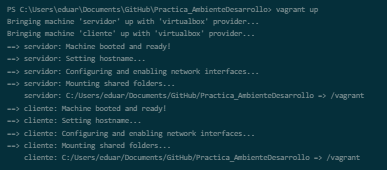
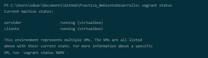
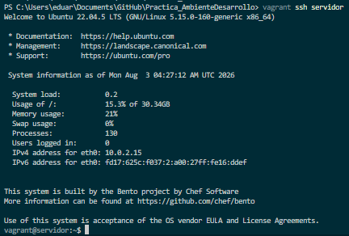
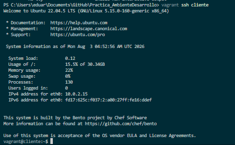
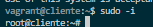
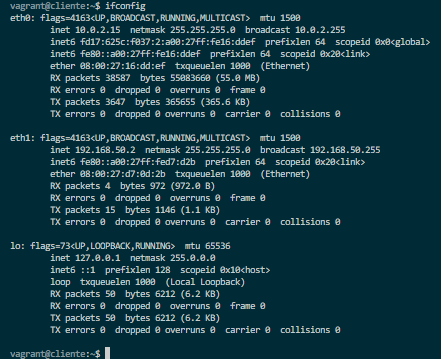
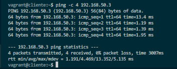

# Práctica: Configuración de Entorno Virtualizado con Vagrant

**Asignatura / Curso:** Ambiente de Desarrollo  
**Profesor:** Oscar Mondragón  
**Repositorio:** `Practica_AmbienteDesarrollo`  
**Estado:** Avance completado hasta Sección 6 y empaquetado local (Sección 7 parcial)  

---

## 📄 Resumen Ejecutivo

Este documento constituye el informe, constatación y archivo de sustentación del laboratorio de **Configuración de Entorno Virtualizado con Vagrant, VirtualBox y Ubuntu**. Contiene la documentación técnica paso a paso, la evidencia fotográfica de la ejecución de comandos y el análisis a profundidad del trabajo realizado hasta el momento, así como la hoja de ruta detallada para culminar la totalidad de la práctica.

---

## 1. Infraestructura y Configuración del Entorno (Secciones 1 - 5)

La arquitectura desplegada consiste en un modelo **Cliente-Servidor** utilizando dos máquinas virtuales interconectadas mediante una red privada local (`192.168.50.0/24`).

### Configuración del `Vagrantfile`
El archivo de orquestación [Vagrantfile](file:///c:/Users/eduar/Documents/GitHub/Practica_AmbienteDesarrollo/Vagrantfile) fue configurado con las siguientes especificaciones:
- **Base Box:** `bento/ubuntu-22.04` (Ubuntu 22.04.5 LTS x86_64)
- **Proveedor:** VirtualBox (1024 MB RAM, 1 vCPU)
- **Máquina `servidor`:** IP Privada `192.168.50.3`, Hostname `servidor`
- **Máquina `cliente`:** IP Privada `192.168.50.2`, Hostname `cliente`

---

## 2. Evidencias de Ejecución y Sustentación Técnica

A continuación se presentan las capturas de pantalla registradas como evidencia de la ejecución del laboratorio:

### 2.1 Despliegue de Máquinas Virtuales
Mediante el comando `vagrant up`, Vagrant descarga la imagen base, crea las instancias en VirtualBox, establece los nombres de host y monta la carpeta compartida (`/vagrant`).



Verificación del estado activo de las máquinas virtuales con `vagrant status`:



---

### 2.2 Conexión y Configuración del Nodo `servidor`
Acceso remoto mediante SSH al nodo servidor (`vagrant ssh servidor`), escalado de privilegios a superusuario (`sudo -i`) e instalación de herramientas de red (`net-tools`) y editor de texto (`vim`).




---

### 2.3 Conexión y Configuración del Nodo `cliente`
Acceso remoto mediante SSH al nodo cliente (`vagrant ssh cliente`), escalado de privilegios (`sudo -i`) e instalación de herramientas de red (`net-tools`).





---

### 2.4 Verificación de Interfaces de Red y Conectividad ICMP

#### Dirección IP en Nodo `servidor`:
Ejecución de `ifconfig` evidenciando la interfaz `eth1` asociada a la IP privada `192.168.50.3`.


#### Dirección IP en Nodo `cliente`:
Ejecución de `ifconfig` evidenciando la interfaz `eth1` asociada a la IP privada `192.168.50.2`.



#### Prueba de Conectividad (Ping):
Verificación de conexión bidireccional desde el `cliente` hacia el `servidor` (`ping -c 4 192.168.50.3`), confirmando 0% de pérdida de paquetes y latencia promedio de 4.46 ms.



---

## 3. Empaquetamiento y Creación de Custom Box (Sección 7 Parcial)

Se procedió a empaquetar el estado actual del `servidor` (con las herramientas instaladas) en un nuevo box reutilizable.

1. **Re-empaquetamiento del servidor:**
   ```bash
   vagrant package servidor --output mynew.box
   ```
   

2. **Registro local del nuevo box:**
   ```bash
   vagrant box add mynewbox mynew.box
   ```
   

---

## 4. Análisis a Profundidad: ¿Qué Falta y Cómo Realizarlo?

Habiendo completado la configuración base, verificación de conectividad y empaquetamiento local (Secciones 1 a 6 + inicio de la 7), **quedan pendientes los siguientes ejercicios obligatorios**:

---

### Checklist de Tareas Pendientes

- [ ] **1. Publicar la Box personalizada en Vagrant Cloud (HashiCorp Cloud)**
- [ ] **2. Investigar y demostrar el funcionamiento de los Directorios Sincronizados (*Synced Folders*)** (Punto 5 - Parte A)
- [x] **3. Realizar el Taller de Comandos Linux del curso** (Punto 4 - Parte A) -> Documentado en [Informe_Ejercicios_Linux.pdf](file:///c:/Users/eduar/Documents/GitHub/Practica_AmbienteDesarrollo/Informe_Ejercicios_Linux.pdf)
- [ ] **4. Configuración de Git, Autenticación PAT (GitHub Token) y Estructura de Repositorio en la VM Servidor** (Parte B)

---

### Guía Detallada Paso a Paso para Completar lo Faltante

#### Tarea 1: Publicación en Vagrant Cloud
1. Iniciar sesión en [HashiCorp Cloud Platform (Vagrant Registry)](https://portal.cloud.hashicorp.com/sign-in).
2. Crear un nuevo **Vagrant Registry** / **Box**:
   - Nombre de la box (ejemplo: `tu_usuario/mynewbox`).
   - Crear una nueva versión (ejemplo: `0.0.1`).
   - Añadir proveedor (**Provider**): `virtualbox`.
   - Cargar (*upload*) el archivo `mynew.box` generado en el proyecto.
   - Hacer clic en **Release version** para hacerla pública/accesible.

#### Tarea 2: Demostración de Directorios Sincronizados (*Synced Folders*)
* **Concepto:** Vagrant mapea por defecto la carpeta del anfitrión (donde reside el `Vagrantfile`) hacia la ruta `/vagrant` dentro del sistema de archivos del cliente/servidor virtualizado.
* **Procedimiento de Demostración:**
  1. En Windows (anfitrión), crear un archivo de prueba:
     ```powershell
     echo "Prueba de sincronizacion Vagrant" > prueba_sincronizacion.txt
     ```
  2. Entrar a la máquina servidor vía SSH (`vagrant ssh servidor`).
  3. Navegar a `/vagrant` y listar el contenido:
     ```bash
     cd /vagrant
     cat prueba_sincronizacion.txt
     ```
  4. Modificar el archivo desde la VM y comprobar que el cambio se refleja inmediatamente en el host. Tomar captura como evidencia.

#### Tarea 3: Taller Linux del Curso
* Ejecutar en el servidor o cliente la serie de ejercicios de consola sobre navegación, permisos (`chmod`, `chown`), gestión de procesos (`ps`, `top`, `kill`), manipulación de texto (`grep`, `awk`, `sed`, `find`) y empaquetado (`tar`, `gzip`).

#### Tarea 4: Git, GitHub Token y Estructura de Repositorios (Parte B)
1. **Instalar Git en la VM Servidor:**
   ```bash
   vagrant ssh servidor
   sudo apt-get update && sudo apt-get install -y git
   ```
2. **Generar un Personal Access Token (PAT) en GitHub:**
   - Ir a GitHub -> *Settings* -> *Developer Settings* -> *Personal Access Tokens (Tokens classic)*.
   - Generar un nuevo token con permisos de `repo`.
3. **Configuración de usuario en la VM:**
   ```bash
   git config --global user.name "Tu Nombre"
   git config --global user.email "tu_email@ejemplo.com"
   ```
4. **Crear Estructura de Directorios requerida:**
   ```bash
   mkdir -p mipracticas/Practica0 mipracticas/Practica1 mipracticas/Practica2
   cd mipracticas
   git init
   git remote add origin https://github.com/TuUsuario/Practica_AmbienteDesarrollo.git
   ```
5. Realizar `git add .`, `git commit -m "Estructura inicial de practicas"` y `git push origin main` utilizando el Token como contraseña.

---

*Documento actualizado y sustentado para entrega.*
