# INFORME TÉCNICO Y PRÁCTICO: CONFIGURACIÓN, SEGURIDAD Y ANÁLISIS DE TRÁFICO DEL SERVIDOR FTP (VSFTPD)

**Asignatura:** Ambiente de Desarrollo / Servicios Telemáticos  
**Profesor:** Prof. Oscar Mondragón  
**Estudiante:** Eduard Criollo Yule  
**Correo Institucional:** `eduard.criollo@uao.edu.co`  
**Semestre:** 9no Semestre  
**Repositorio:** [Practica_AmbienteDesarrollo](https://github.com/CriolloYule/Practica_AmbienteDesarrollo)  
**Directorio de la Práctica:** `mipracticas/Practica1`  

---

## 1. Resumen Ejecutivo y Objetivos

### 1.1 Resumen Ejecutivo
El presente informe documenta de manera técnica, rigurosa y paso a paso la implementación, administración y aseguramiento de un servidor de archivos **FTP (File Transfer Protocol)** utilizando el demonio **vsftpd** (*Very Secure FTP Daemon*) sobre una infraestructura virtualizada cliente-servidor en Ubuntu Linux 22.04 LTS controlada por Vagrant y VirtualBox. Se abordan desde la edición fina de directivas en `/etc/vsftpd.conf` para usuarios locales y anónimos, la implementación de mecanismos de aislamiento de seguridad (*chroot jail* y listas de control de acceso `userlist`), hasta la validación mediante clientes en línea de comandos, clientes gráficos (FileZilla) y la inspección de tramas de red a nivel de paquetes mediante Wireshark.

### 1.2 Objetivos del Laboratorio
1. **Comprender la Arquitectura y Funcionamiento de FTP:** Analizar el modelo cliente-servidor de FTP, la separación de canales de control (puerto 21) y de datos (puertos dinámicos/20), y la diferencia entre usuarios anónimos, reales e invitados.
2. **Configurar vsftpd sobre Linux Ubuntu:** Modificar y aplicar directivas booleanas, numéricas y de cadena en el archivo `/etc/vsftpd.conf`.
3. **Validar Operaciones de Transferencia:** Probar la subida (*upload*), descarga (*download*), listado y permisos de archivos entre el nodo cliente y el servidor.
4. **Implementar Aislamiento y Control de Acceso:** Enjaular usuarios en su directorio personal (`chroot`) y aplicar listas de denegación/permiso (`userlist_deny`).
5. **Aprovisionar Servicios para Usuarios Anónimos:** Configurar raíces personalizadas (`anon_root`) y estructuras de permisos seguro en carpetas públicas.
6. **Analizar Tráfico de Red con Wireshark:** Capturar la interacción entre FileZilla en la máquina anfitriona y el servidor FTP enjaulado, evaluando la diferencia conceptual y operativa entre el Modo Activo y el Modo Pasivo.

---

## 2. Arquitectura de Infraestructura y Topología de Red

La práctica se desarrolla sobre la infraestructura multinodo aprovisionada en Vagrant con la siguiente topología de red privada local (`192.168.50.0/24`):

```
+-----------------------------------------------------------------------------------+
|                              WINDOWS ANFITRIÓN (HOST)                             |
|             IP Interfaz VirtualBox (Ethernet 3): 192.168.50.1                     |
|             Clientes: FileZilla GUI / Wireshark Packet Capture                    |
+-----------------------------------------+-----------------------------------------+
                                          |
                                          | Red Privada Host-Only (192.168.50.0/24)
                                          v
+-----------------------------------------+-----------------------------------------+
|                  ENTORNO DE VIRTUALIZACIÓN VAGRANT / VIRTUALBOX                   |
|                                                                                   |
|   +------------------------------------+     +--------------------------------+   |
|   |          NODO: SERVIDOR            |     |          NODO: CLIENTE         |   |
|   | Hostname: servidor                 |     | Hostname: cliente              |   |
|   | IP Privada: 192.168.50.3           | ICMP| IP Privada: 192.168.50.2      |   |
|   | Servicio: vsftpd 3.0.5             |====>| Cliente: ftp CLI (net-tools)  |   |
|   | Puertos: 21 (Control), PASV (Datos)|     |                                |   |
|   +------------------------------------+     +--------------------------------+   |
+-----------------------------------------------------------------------------------+
```

---

## 3. Desarrollo Detallado de los Puntos del Taller y Evidencias Visuales

A continuación se presenta el desarrollo riguroso de cada uno de los 11 puntos establecidos en la guía oficial del taller `2024-01 Practica FTP.pdf`, incorporando las 36 evidencias fotográficas formateadas y renombradas secuencialmente.

---

### Punto 1: Diferencia entre Usuarios Anónimos, Reales e Invitados

En la gestión de servidores FTP con vsftpd, existen tres categorías fundamentales de cuentas de usuario:

1. **Usuarios Anónimos (`anonymous` / `ftp`):**
   * **Definición:** Cuentas públicas que no requieren una contraseña propia o aceptan cualquier correo electrónico genérico como clave.
   * **Mapeo en el SO:** En el sistema operativo se mapean internamente al usuario sin privilegios `ftp` o `nobody`.
   * **Uso Típico:** Servidores de distribución masiva de archivos públicos, repositorios de software y documentación institucional donde no se requiere autenticación individual.
2. **Usuarios Reales (Locales):**
   * **Definición:** Cuentas de usuario registradas legítimamente en el sistema operativo servidor (existen en `/etc/passwd` y `/etc/shadow`), tales como `usuario_real` o `vagrant`.
   * **Mapeo en el SO:** Tienen un identificador único (UID/GID), su propia carpeta personal (`/home/nombre_usuario`), y ejecutan acciones con los permisos nativos de Linux.
   * **Uso Típico:** Usuarios corporativos o administradores que necesitan subir, modificar o gestionar sus propios documentos personales alojados en el servidor.
3. **Usuarios Invitados (*Guest Users*):**
   * **Definición:** Usuarios virtuales que se autentican en el servidor FTP utilizando credenciales almacenadas en una base de datos externa (ej. MySQL, PAM o archivos de texto), pero que dentro del sistema Linux no poseen una cuenta real de sistema.
   * **Mapeo en el SO:** Se mapean todos a una única cuenta real del sistema con privilegios mínimos y shell restringido (`/bin/false` o `/nologin`).
   * **Uso Típico:** Servicios masivos de alojamiento web o almacenamiento en la nube (*hosting* multi-inquilino) donde se previene el riesgo de que miles de usuarios tengan acceso a la shell del SO.

---

### Punto 2: Habilitación de la Directiva `write_enable=YES`

Para permitir que los usuarios autenticados puedan realizar modificaciones en el sistema de archivos remoto (subir archivos `STOR`, crear directorios `MKD`, eliminar `DELE`), es indispensable activar la directiva de escritura global en `/etc/vsftpd.conf`.

#### Evidencia 01: Configuración de `write_enable=YES`
* **Ruta de Evidencia:** `images/01_config_write_enable.png`

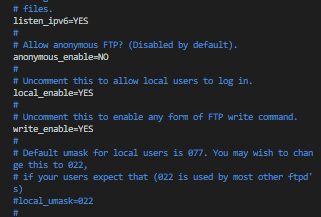

* **Análisis Técnico:**  
  En el archivo `/etc/vsftpd.conf`, se observa la configuración activa de las directivas básicas:
  - `listen_ipv6=YES`: Habilita la escucha de conexiones IPv6 y sockets IPv4 asociados.
  - `anonymous_enable=NO`: Deshabilita temporalmente el acceso anónimo.
  - `local_enable=YES`: Permite el inicio de sesión a los usuarios locales del SO.
  - `write_enable=YES`: Habilita los comandos de modificación de archivos vía FTP.

---

### Punto 3: Creación de Usuarios Reales y Verificación del Servicio

Se procede a crear el usuario `usuario_real` en el nodo servidor y a validar el estado operativo del demonio `vsftpd`.

#### Evidencia 02: Creación de `usuario_real` en el Servidor
* **Ruta de Evidencia:** `images/02_crear_usuario_real.png`

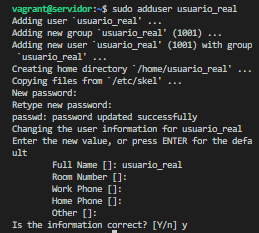

* **Análisis Técnico:**  
  En la consola `vagrant@servidor`, se ejecuta `sudo adduser usuario_real`. El comando crea el grupo `usuario_real` (GID 1001), asigna el UID 1001 y genera la estructura de directorio personal en `/home/usuario_real` copiando las plantillas base desde `/etc/skel`.

#### Evidencia 03: Reinicio y Verificación del Servicio `vsftpd`
* **Ruta de Evidencia:** `images/03_servicio_vsftpd_activo.png`

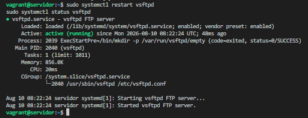

* **Análisis Técnico:**  
  Se ejecutan `sudo systemctl restart vsftpd` y `sudo systemctl status vsftpd`. La salida confirma que el proceso daemon `/usr/sbin/vsftpd /etc/vsftpd.conf` se encuentra en estado `active (running)` con PID 2040.

#### Evidencia 04: Login Exitoso con Usuario Real y Verificación de `pwd`
* **Ruta de Evidencia:** `images/04_login_usuario_real_pwd.png`

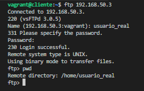

* **Análisis Técnico:**  
  Desde el nodo cliente (`vagrant@cliente`), se inicia sesión remota hacia la IP `192.168.50.3`:
  - Servidor responde: `220 (vsFTPd 3.0.5)`.
  - Se ingresa usuario `usuario_real` y su contraseña.
  - Servidor responde: `230 Login successful`.
  - Al ejecutar `pwd` (*Print Working Directory*), el servidor retorna `/home/usuario_real`.

**¿En qué parte se encuentran ubicados los archivos a los cuales tienen acceso estos usuarios?**  
Por defecto, cuando un usuario real se conecta vía FTP sin restricciones de *chroot*, el servidor lo ubica inicialmente en su propio directorio de inicio o *Home Directory* (`/home/usuario_real`). No obstante, si el enjaulamiento no está activo, el usuario puede navegar a través de todo el árbol de directorios del sistema operativo sobre los cuales la cuenta de Linux tenga permisos de lectura (`/etc`, `/var`, `/tmp`, etc.).

---

### Punto 4: Descarga y Subida de Archivos al Servidor FTP

Para comprobar la transferencia bidireccional en tiempo real, se crean archivos de prueba en ambos extremos y se ejecutan las operaciones de transferencia.

#### Evidencia 05: Creación del Archivo de Prueba en el Servidor
* **Ruta de Evidencia:** `images/05_crear_archivo_servidor.png`

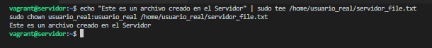

* **Análisis Técnico:**  
  En `vagrant@servidor`, se genera el archivo `/home/usuario_real/servidor_file.txt` con el texto `"Este es un archivo creado en el Servidor"` y se ajusta la propiedad a `usuario_real:usuario_real` mediante `sudo chown`.

#### Evidencia 06: Creación del Archivo de Prueba en el Cliente
* **Ruta de Evidencia:** `images/06_crear_archivo_cliente.png`

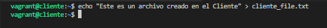

* **Análisis Técnico:**  
  En `vagrant@cliente`, se crea localmente el archivo `cliente_file.txt` conteniendo la cadena `"Este es un archivo creado en el Cliente"`.

#### Evidencia 07: Transferencia FTP (Subida con `put` y Descarga con `get`)
* **Ruta de Evidencia:** `images/07_ftp_transferencia_archivos.png`

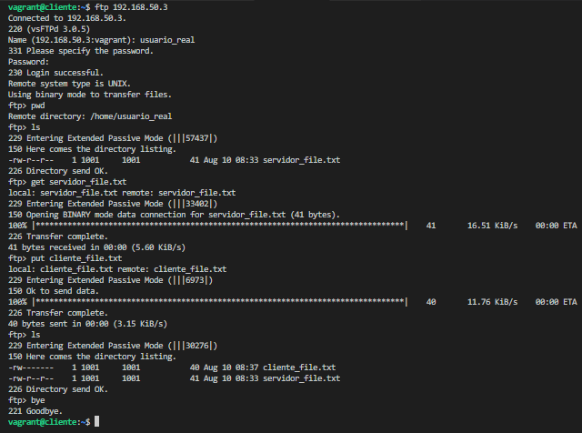

* **Análisis Técnico:**  
  En la sesión FTP interactiva desde el cliente hacia `192.168.50.3`:
  1. `ls`: Entra en Modo Pasivo Extendido (EPSV port 57437) y lista `servidor_file.txt`.
  2. `get servidor_file.txt`: Descarga el archivo desde el servidor al cliente (41 bytes transferidos exitosamente a 16.51 KiB/s).
  3. `put cliente_file.txt`: Sube el archivo desde el cliente al servidor (40 bytes enviando comando `STOR`).
  4. `ls`: Confirma que ambos archivos coexisten en el directorio remoto `/home/usuario_real`.

---

### Punto 5: Personalización del Mensaje de Bienvenida (*Banner*)

Se modifica la directiva de bienvenida para que el servidor exponga una identificación corporativa o de bienvenida personalizada.

#### Evidencia 08: Apertura de la Configuración en el Servidor
* **Ruta de Evidencia:** `images/08_config_editar_banner.png`

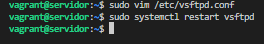

* **Análisis Técnico:**  
  Ejecución de `sudo vim /etc/vsftpd.conf` y posterior restart del servicio para aplicar los cambios del banner.

#### Evidencia 09: Edición de la Directiva `ftpd_banner`
* **Ruta de Evidencia:** `images/09_config_ftpd_banner.png`

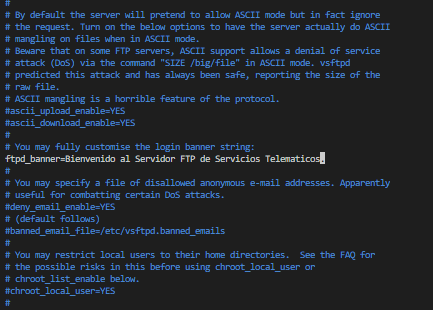

* **Análisis Técnico:**  
  Se desmarca y modifica la directiva:  
  `ftpd_banner=Bienvenido al Servidor FTP de Servicios Telematicos.`

#### Evidencia 10: Verificación del Nuevo Mensaje de Bienvenida
* **Ruta de Evidencia:** `images/10_verificacion_banner_bienvenida.png`

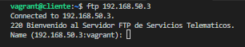

* **Análisis Técnico:**  
  Al conectar desde el cliente con `ftp 192.168.50.3`, la respuesta inicial del servicio incluye el código `220` seguido de la cadena personalizada: `220 Bienvenido al Servidor FTP de Servicios Telematicos.`

---

### Punto 6: Enjaulamiento de Usuarios Reales (*Chroot Jail*)

El enjaulamiento (*chroot*) es un mecanismo crítico de seguridad que confina a los usuarios locales a su propio directorio personal, impidiéndoles explorar el sistema de archivos raíz (`/`).

#### Evidencia 11: Apertura de `/etc/vsftpd.conf` para Chroot
* **Ruta de Evidencia:** `images/11_config_abrir_vsftpd_chroot.png`

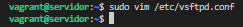

* **Análisis Técnico:**  
  Acceso a la sección de restricción de usuarios locales en el archivo de configuración.

#### Evidencia 12: Activación de `chroot_local_user=YES`
* **Ruta de Evidencia:** `images/12_config_chroot_local_user.png`

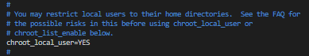

* **Análisis Técnico:**  
  Se descomenta la directiva `chroot_local_user=YES`. Esto fuerza a vsftpd a realizar una llamada al sistema `chroot()` tras la autenticación de cualquier usuario local.

#### Evidencia 13: Inclusión de `allow_writeable_chroot=YES`
* **Ruta de Evidencia:** `images/13_config_allow_writeable_chroot.png`

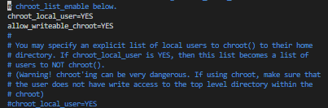

* **Análisis Técnico:**  
  Por razones de seguridad contra vulnerabilidades de escalado de privilegios, vsftpd bloquea el inicio de sesión si la raíz del directorio *chroot* tiene permisos de escritura. Al agregar la directiva `allow_writeable_chroot=YES`, se permite la conexión cuando el directorio personal posee permisos de escritura sin fallar con error 500.

#### Evidencia 14: Configuración de la Lista de Excepciones `chroot_list_enable=YES`
* **Ruta de Evidencia:** `images/14_config_chroot_list_enable.png`

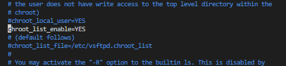

* **Análisis Técnico:**  
  Se prueba la activación combinada de `chroot_list_enable=YES` para gestionar excepciones específicas de usuarios.

#### Evidencia 15: Especificación de la Ruta `chroot_list_file`
* **Ruta de Evidencia:** `images/15_config_chroot_list_file.png`


* **Análisis Técnico:**  
  Definición de la directiva `chroot_list_file=/etc/vsftpd.chroot_list`.

#### Evidencia 16: Creación del Archivo de Lista y Reinicio del Servicio
* **Ruta de Evidencia:** `images/16_crear_chroot_list_restart.png`

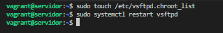

* **Análisis Técnico:**  
  Se crea el archivo vacío mediante `sudo touch /etc/vsftpd.chroot_list` y se reinicia vsftpd.

#### Evidencia 17: Demostración de Navegación según Configuración de Chroot
* **Ruta de Evidencia:** `images/17_prueba_navegacion_chroot_list.png`

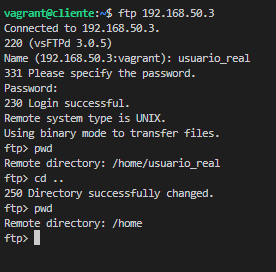

* **Análisis Técnico:**  
  En la sesión FTP de `usuario_real`, al ejecutar `pwd` el sistema indica `/home/usuario_real`. Al intentar realizar `cd ..`, si la directiva `chroot_local_user` está en `NO` o el usuario está exceptuado en la lista, la respuesta es `250 Directory successfully changed` permitiéndole subir a `/home` o `/`.

**¿Qué sucede si cambia el valor de la directiva `chroot_local_user` a NO?**  
Si `chroot_local_user=NO` (y `chroot_list_enable=NO`), el servidor FTP inhabilita el aislamiento de procesos. El usuario real ingresa a su directorio de inicio, pero **conserva la facultad de navegar libremente por la jerarquía superior del sistema de archivos Linux (`/home`, `/etc`, `/var`, `/usr`)**, pudiendo descargar archivos confidenciales del sistema operativo que posean permisos de lectura pública (ej. `/etc/passwd`, `/etc/issue`), lo cual representa una severa brecha de seguridad.

---

### Punto 7: Restricción del Acceso a Usuarios Reales por Seguridad

Debido a los riesgos que implica exponer cuentas reales del SO a través de protocolos en texto claro como FTP, se implementan controles para restringir o bloquear su ingreso.

#### Evidencia 18: Apertura de Configuración de Restricción
* **Ruta de Evidencia:** `images/18_config_abrir_vsftpd_restriccion.png`

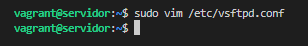

* **Análisis Técnico:**  
  Preparación para modificar las directivas de control de acceso local.

#### Evidencia 19: Deshabilitación Global con `local_enable=NO`
* **Ruta de Evidencia:** `images/19_config_local_enable_no.png`

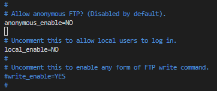

* **Análisis Técnico:**  
  Se establece `local_enable=NO`. Esto impide el inicio de sesión a cualquier usuario real en el sistema de manera global.

#### Evidencia 20: Reinicio de vsftpd tras Cambio Global
* **Ruta de Evidencia:** `images/20_restart_vsftpd_restriccion.png`

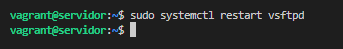

* **Análisis Técnico:**  
  Aplicación de cambios mediante `sudo systemctl restart vsftpd`.

#### Evidencia 21: Restricción Granular mediante `userlist_deny=YES`
* **Ruta de Evidencia:** `images/21_config_userlist_deny.png`

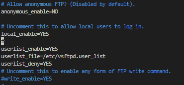

* **Análisis Técnico:**  
  Para un control más preciso (manteniendo `local_enable=YES`), se activa la lista de control de usuarios:
  - `userlist_enable=YES`
  - `userlist_file=/etc/vsftpd.user_list`
  - `userlist_deny=YES`: Especifica que los usuarios listados en dicho archivo tendrán **denegado expresamente** el acceso.

#### Evidencia 22: Adición de `usuario_real` a la Lista Negra `/etc/vsftpd.user_list`
* **Ruta de Evidencia:** `images/22_agregar_usuario_user_list.png`

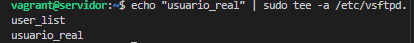

* **Análisis Técnico:**  
  Se ejecuta `echo "usuario_real" | sudo tee -a /etc/vsftpd.user_list` para registrar a dicho usuario dentro del filtro de acceso.

#### Evidencia 23: Reinicio del Servicio post-configuración de User List
* **Ruta de Evidencia:** `images/23_restart_vsftpd_userlist.png`

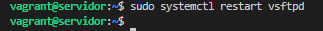

* **Análisis Técnico:**  
  Reinicio de vsftpd para cargar en memoria la nueva lista de denegación.

#### Evidencia 24: Verificación del Bloqueo de Acceso (`530 Permission denied`)
* **Ruta de Evidencia:** `images/24_verificacion_login_denegado.png`

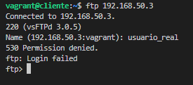

* **Análisis Técnico:**  
  Al intentar ingresar desde el cliente como `usuario_real`, el servidor rechaza inmediatamente la autenticación antes de solicitar o validar la contraseña con el mensaje: `530 Permission denied. ftp: Login failed`.

**¿Cómo se restrinja el acceso a usuarios reales?**  
Se realiza mediante dos metodologías:
1. **Bloqueo Total:** Configurando `local_enable=NO` en `/etc/vsftpd.conf`.
2. **Bloqueo Selectivo por Lista Negra:** Habilitando `userlist_enable=YES`, `userlist_deny=YES` y agregando los nombres de usuario no deseados en `/etc/vsftpd.user_list` (o utilizando el archivo del sistema `/etc/ftpusers`).

---

### Punto 8: Configuración y Verificación de FTP Anónimo

Se configura el servidor para permitir el ingreso de usuarios anónimos restringidos a una carpeta raíz específica (`/var/anonymous/`).

#### Evidencia 25: Creación de la Estructura de Directorios y Asignación de Permisos
* **Ruta de Evidencia:** `images/25_crear_directorios_anonimos.png`

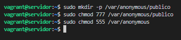

* **Análisis Técnico:**  
  En el servidor se ejecutan los comandos de preparación de directorio:
  - `sudo mkdir -p /var/anonymous/publico`
  - `sudo chmod 777 /var/anonymous/publico`: Otorga permisos totales de lectura, escritura y ejecución en la subcarpeta para permitir subidas.
  - `sudo chmod 555 /var/anonymous`: Restringe la raíz anónima a solo lectura/ejecución (requisito estricto de seguridad de vsftpd para evitar fallos en chroot anónimo).

#### Evidencia 26: Apertura del Archivo de Configuración
* **Ruta de Evidencia:** `images/26_config_abrir_vsftpd_anonimo.png`

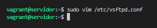

* **Análisis Técnico:**  
  Edición con `sudo vim /etc/vsftpd.conf`.

#### Evidencia 27: Configuración Completa de Directivas Anónimas
* **Ruta de Evidencia:** `images/27_config_ftp_anonimo_completa.png`

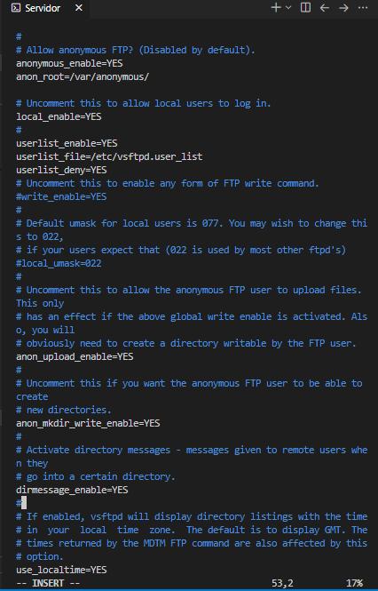

* **Análisis Técnico:**  
  Se establecen las siguientes directivas en `/etc/vsftpd.conf`:
  - `anonymous_enable=YES`: Habilita el acceso anónimo.
  - `anon_root=/var/anonymous/`: Cambia la raíz del FTP anónimo a la ruta deseada.
  - `anon_upload_enable=YES`: Permite que los usuarios anónimos suban archivos.
  - `anon_mkdir_write_enable=YES`: Permite a los anónimos crear nuevos directorios.
  - `dirmessage_enable=YES`: Habilita mensajes de directorio `.message`.
  - `use_localtime=YES`: Muestra horas en zona horaria local.

#### Evidencia 28: Reinicio del Servicio vsftpd
* **Ruta de Evidencia:** `images/28_restart_vsftpd_anonimo.png`


* **Análisis Técnico:**  
  Reinicio del demonio vsftpd para aplicar los parámetros anónimos.

#### Evidencia 29: Creación de Archivo de Prueba en el Directorio Público
* **Ruta de Evidencia:** `images/29_crear_archivo_anon_descarga.png`

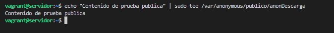

* **Análisis Técnico:**  
  En el servidor se genera el archivo para pruebas de descarga:  
  `echo "Contenido de prueba publica" | sudo tee /var/anonymous/publico/anonDescarga`

#### Evidencia 30: Prueba Completa de FTP Anónimo desde el Cliente (Subida y Descarga)
* **Ruta de Evidencia:** `images/30_prueba_ftp_anonimo_cliente.png`

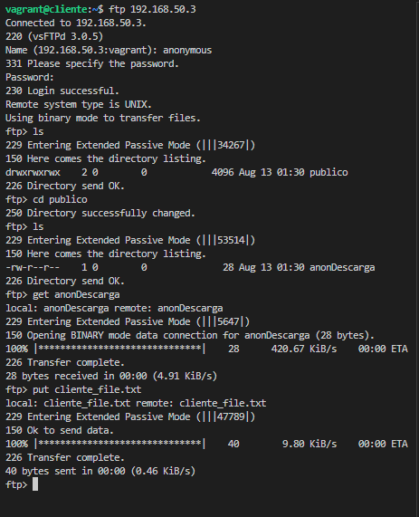

* **Análisis Técnico:**  
  Desde `vagrant@cliente`:
  1. `ftp 192.168.50.3` ingresando con usuario `anonymous` (password en blanco).
  2. `ls`: Muestra la carpeta `publico`.
  3. `cd publico`: Ingresa a la subcarpeta pública.
  4. `get anonDescarga`: Descarga satisfactoria de 28 bytes.
  5. `put cliente_file.txt`: Subida exitosa de 40 bytes en la carpeta pública anónima.

---

### Punto 9: Instalación y Demostración de Cliente FTP Gráfico (FileZilla) en el Anfitrión

Se utiliza el cliente gráfico FileZilla desde la máquina anfitriona Windows para interactuar visualmente con el servidor FTP.

#### Evidencia 31: Verificación de Conectividad mediante ICMP Ping (Host Windows -> VM Servidor)
* **Ruta de Evidencia:** `images/31_ping_host_a_servidor.png`

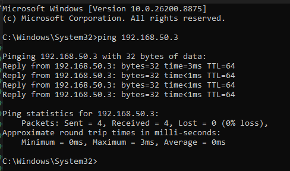

* **Análisis Técnico:**  
  En el CMD de Windows se ejecuta `ping 192.168.50.3`. Se reciben 4 respuestas satisfactorias con tiempos de respuesta <1 ms y 0% de pérdida de paquetes.

#### Evidencia 32: Conexión Exitosa en FileZilla GUI
* **Ruta de Evidencia:** `images/32_filezilla_conexion_exitosa.png`

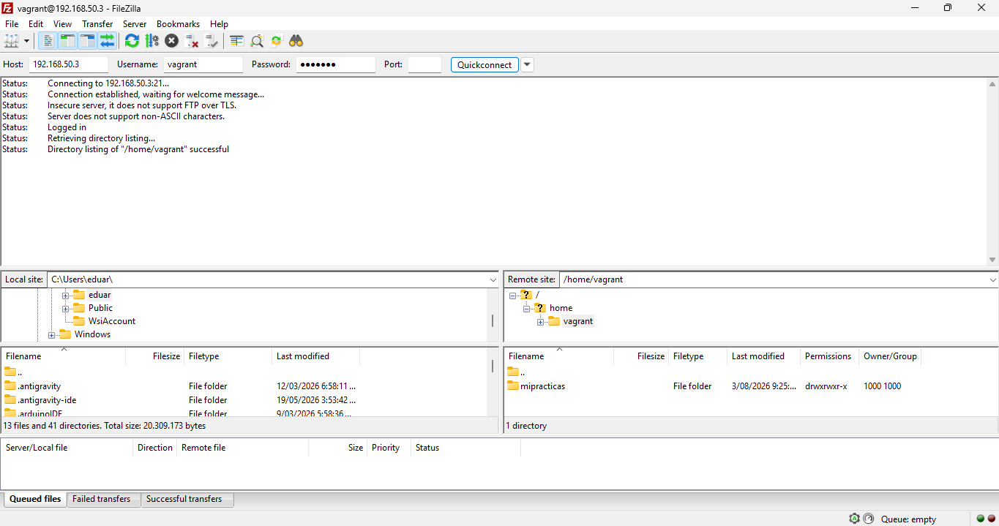

* **Análisis Técnico:**  
  En FileZilla se ingresa el Host `192.168.50.3`, usuario `vagrant`, puerto `21`. La consola de estado confirma: `Status: Logged in` y muestra el árbol de directorios remoto `/home/vagrant`.

#### Evidencia 33: Subida de Archivo a través de FileZilla
* **Ruta de Evidencia:** `images/33_filezilla_subida_archivo.png`

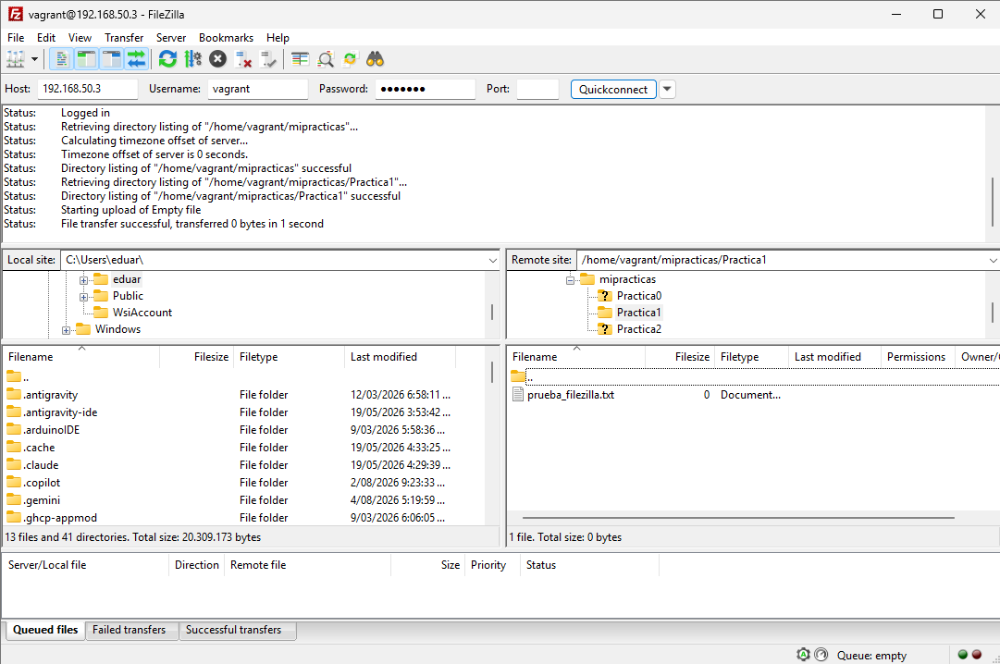

* **Análisis Técnico:**  
  Se arrastra el archivo `prueba_filezilla.txt` hacia el sitio remoto `/home/vagrant/mipracticas/Practica1`. El log confirma: `File transfer successful, transferred 0 bytes in 1 second`.

#### Evidencia 34: Descarga de Archivo desde FileZilla
* **Ruta de Evidencia:** `images/34_filezilla_descarga_archivo.png`

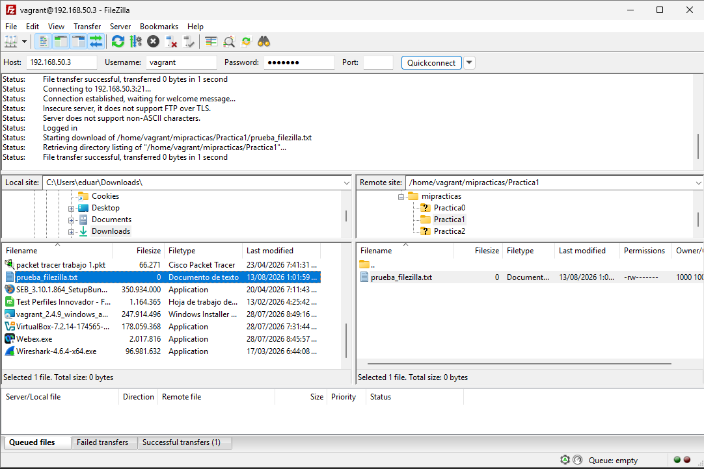

* **Análisis Técnico:**  
  Se transfiere el archivo `prueba_filezilla.txt` desde el servidor remoto a la carpeta local `C:\Users\eduar\Downloads\`, confirmando la operatividad bidireccional de la interfaz gráfica.

---

### Puntos 10 y 11: Captura de Tramas con Wireshark y Análisis del Modo de Conexión FTP

Se ejecuta una captura de paquetes durante una sesión de FileZilla para analizar el tráfico del protocolo FTP.

#### Evidencia 35: Inspección de la Interfaz de Red del Anfitrión (`ipconfig`)
* **Ruta de Evidencia:** `images/35_host_ipconfig_interfaz.png`

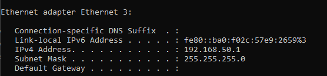

* **Análisis Técnico:**  
  La ejecución de `ipconfig` en Windows permite identificar la interfaz de red virtual `Ethernet 3` asignada por VirtualBox Host-Only con IP `192.168.50.1`, la cual es seleccionada en Wireshark para capturar el tráfico hacia la IP `192.168.50.3`.

#### Evidencia 36: Tráfico y Transferencia de Archivos en FileZilla para Wireshark
* **Ruta de Evidencia:** `images/36_filezilla_trafico_wireshark.png`

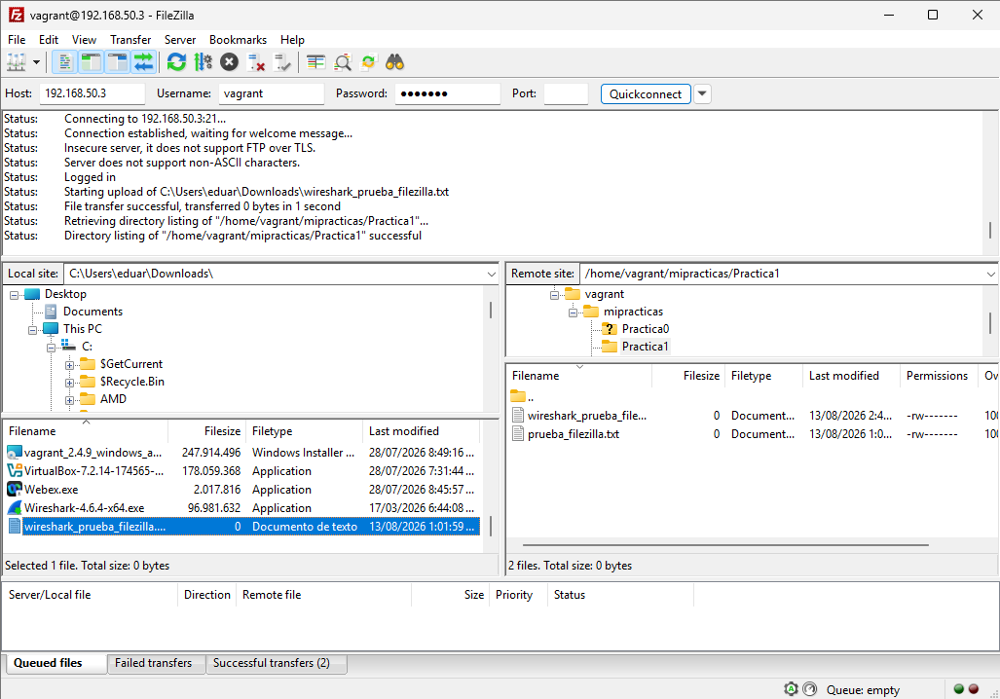

* **Análisis Técnico:**  
  FileZilla genera tráfico FTP al subir `wireshark_prueba_filezilla.txt` hacia el servidor.

#### Análisis del Proceso, Comandos e Inspección del Modo de Conexión en Wireshark

1. **Flujo de Comandos FTP Capturados:**
   * **Handshake TCP:** Establecimiento del socket en el puerto 21 (SYN, SYN-ACK, ACK).
   * **`220` Banner:** El servidor envía el mensaje de bienvenida.
   * **`USER vagrant`:** Envío del nombre de usuario en texto claro.
   * **`331 Please specify the password.`:** Solicitud de clave.
   * **`PASS vagrant`:** Envío de la contraseña en texto claro (demostrando la vulnerabilidad inherente de FTP sin TLS/SSL).
   * **`230 Login successful.`:** Autenticación concedida.
   * **`SYST` & `PWD`:** El cliente consulta el tipo de sistema operativo y el directorio actual.
   * **`EPSV` / `PASV`:** El cliente solicita entrar en Modo Pasivo.
   * **`229 Entering Extended Passive Mode (|||53514|)`:** El servidor responde el puerto dinámico de datos (53514).
   * **`STOR / RETR`:** Inicio del canal de datos para la transferencia de archivos.
   * **`QUIT` / `221 Goodbye.`:** Cierre de la sesión de control.

2. **¿Qué modo de conexión está usando y en qué consiste?**
   * **Modo Detectado:** **Modo Pasivo Extendido (EPSV / PASV)**.
   * **Fundamentos del Modo Pasivo (PASV):**
     Iniciado cuando el cliente envía el comando `PASV` o `EPSV`. En este modo, **el cliente es quien inicia ambas conexiones TCP (tanto la de Control como la de Datos)**:
     - *Canal de Control:* Cliente (puerto aleatorio N) $\rightarrow$ Servidor (Puerto 21).
     - *Canal de Datos:* El servidor abre un puerto dinámico no privilegiado $P > 1024$ (ej. 53514) y se lo informa al cliente en la respuesta `227/229`. El cliente abre un nuevo socket desde su puerto $N+1$ hacia el puerto $P$ del servidor.
   * **Diferencia con el Modo Activo (PORT):**
     En el **Modo Activo**, el cliente envía el comando `PORT h1,h2,h3,h4,p1,p2`, informando su propia dirección IP y un puerto abierto en su máquina. Luego, **el servidor inicia la conexión de datos desde su puerto 20 hacia el puerto del cliente**.
   * **Por qué prevalece el Modo Pasivo:**  
     En redes modernas con cortafuegos (Firewalls) o routers con traducción de direcciones de red (NAT) en el cliente, las conexiones entrantes no solicitadas (como las del Modo Activo desde el servidor puerto 20) son bloqueadas por defecto. El Modo Pasivo soluciona este problema permitiendo que todo el tráfico sea saliente desde el cliente.

---

## 4. Tabla Resumen de Evidencias e Imágenes

| Número | Archivo Renombrado | Descripción de la Evidencia | Punto del Taller |
| :---: | :--- | :--- | :---: |
| **01** | `01_config_write_enable.png` | Configuración de directiva `write_enable=YES` en `vsftpd.conf` | Punto 2 |
| **02** | `02_crear_usuario_real.png` | Creación de `usuario_real` con `sudo adduser` | Punto 3 |
| **03** | `03_servicio_vsftpd_activo.png` | Estado `active (running)` del servicio vsftpd | Punto 3 |
| **04** | `04_login_usuario_real_pwd.png` | Login exitoso de usuario real y comprobación de `pwd` | Punto 3 |
| **05** | `05_crear_archivo_servidor.png` | Creación de archivo de prueba `servidor_file.txt` | Punto 4 |
| **06** | `06_crear_archivo_cliente.png` | Creación de archivo de prueba `cliente_file.txt` | Punto 4 |
| **07** | `07_ftp_transferencia_archivos.png` | Transferencia bidireccional (`get` y `put`) en FTP CLI | Punto 4 |
| **08** | `08_config_editar_banner.png` | Comando para editar `vsftpd.conf` y reiniciar servicio | Punto 5 |
| **09** | `09_config_ftpd_banner.png` | Configuración de directiva `ftpd_banner` personalizada | Punto 5 |
| **10** | `10_verificacion_banner_bienvenida.png` | Verificación de respuesta `220` con banner personalizado | Punto 5 |
| **11** | `11_config_abrir_vsftpd_chroot.png` | Apertura de archivo `vsftpd.conf` para sección chroot | Punto 6 |
| **12** | `12_config_chroot_local_user.png` | Activación de directiva `chroot_local_user=YES` | Punto 6 |
| **13** | `13_config_allow_writeable_chroot.png` | Inclusión de directiva `allow_writeable_chroot=YES` | Punto 6 |
| **14** | `14_config_chroot_list_enable.png` | Configuración de `chroot_list_enable=YES` | Punto 6 |
| **15** | `15_config_chroot_list_file.png` | Especificación de ruta `chroot_list_file` | Punto 6 |
| **16** | `16_crear_chroot_list_restart.png` | Creación de archivo `vsftpd.chroot_list` y restart | Punto 6 |
| **17** | `17_prueba_navegacion_chroot_list.png` | Prueba de navegación cuando chroot está desactivado | Punto 6 |
| **18** | `18_config_abrir_vsftpd_restriccion.png` | Edición de `vsftpd.conf` para restricción de usuarios | Punto 7 |
| **19** | `19_config_local_enable_no.png` | Deshabilitación global `local_enable=NO` | Punto 7 |
| **20** | `20_restart_vsftpd_restriccion.png` | Reinicio de servicio vsftpd post-restricción global | Punto 7 |
| **21** | `21_config_userlist_deny.png` | Configuración de `userlist_enable` y `userlist_deny=YES` | Punto 7 |
| **22** | `22_agregar_usuario_user_list.png` | Inclusión de `usuario_real` en `/etc/vsftpd.user_list` | Punto 7 |
| **23** | `23_restart_vsftpd_userlist.png` | Reinicio de servicio vsftpd tras actualizar user_list | Punto 7 |
| **24** | `24_verificacion_login_denegado.png` | Verificación de bloqueo `530 Permission denied` | Punto 7 |
| **25** | `25_crear_directorios_anonimos.png` | Creación de carpetas `/var/anonymous/publico` y `chmod` | Punto 8 |
| **26** | `26_config_abrir_vsftpd_anonimo.png` | Edición de `vsftpd.conf` para FTP Anónimo | Punto 8 |
| **27** | `27_config_ftp_anonimo_completa.png` | Configuración completa de directivas `anon_root` y subida | Punto 8 |
| **28** | `28_restart_vsftpd_anonimo.png` | Reinicio de vsftpd post-configuración anónima | Punto 8 |
| **29** | `29_crear_archivo_anon_descarga.png` | Creación de archivo `anonDescarga` en carpeta pública | Punto 8 |
| **30** | `30_prueba_ftp_anonimo_cliente.png` | Prueba de subida/descarga como usuario `anonymous` | Punto 8 |
| **31** | `31_ping_host_a_servidor.png` | Prueba ICMP ping desde Host Windows a VM Servidor | Punto 9 |
| **32** | `32_filezilla_conexion_exitosa.png` | Conexión FTP exitosa en cliente FileZilla GUI | Punto 9 |
| **33** | `33_filezilla_subida_archivo.png` | Subida de archivo por FileZilla GUI | Punto 9 |
| **34** | `34_filezilla_descarga_archivo.png` | Descarga de archivo por FileZilla GUI | Punto 9 |
| **35** | `35_host_ipconfig_interfaz.png` | Inspección de IP de interfaz VirtualBox con `ipconfig` | Puntos 10/11 |
| **36** | `36_filezilla_trafico_wireshark.png` | Transferencia de archivos en FileZilla para Wireshark | Puntos 10/11 |

---

## 5. Conclusiones Técnicas

1. **Flexibilidad y Control Fino en vsftpd:** El demonio vsftpd proporciona un mecanismo de configuración sumamente granular mediante `/etc/vsftpd.conf`. La combinación de directivas booleanas y listas de control permite adaptar el servidor tanto para escenarios corporativos privados estrictos como para repositorios anónimos públicos.
2. **Importancia del Enjaulamiento (*Chroot*):** Habilitar `chroot_local_user=YES` junto con `allow_writeable_chroot=YES` resulta imperativo para mitigar riesgos de seguridad. Sin este mecanismo, cualquier usuario autenticado legítimamente puede explorar la raíz del SO y acceder a información confidencial del sistema.
3. **Inseguridad Inherente del Protocolo FTP Clásico:** La captura realizada en Wireshark evidenció de forma transparente que tanto el usuario (`USER`) como la contraseña (`PASS`) se transmiten sin ningún tipo de cifrado a través de la red en texto claro. En entornos de producción reales, se debe exigir el uso de **FTPS (FTP over TLS/SSL)** o **SFTP (SSH File Transfer Protocol)**.
4. **Dominio del Modo Pasivo en Entornos Virtualizados:** El análisis del intercambio de tramas confirmó la efectividad del Modo Pasivo (`PASV` / `EPSV`). Al hacer que el cliente inicie la conexión hacia un puerto de datos dinámico expuesto por el servidor, se evitan los bloqueos producidos por cortafuegos o tablas NAT que inutilizan el Modo Activo tradicional.
