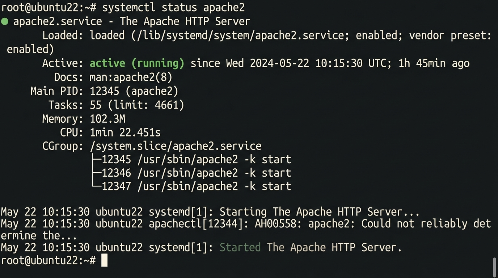
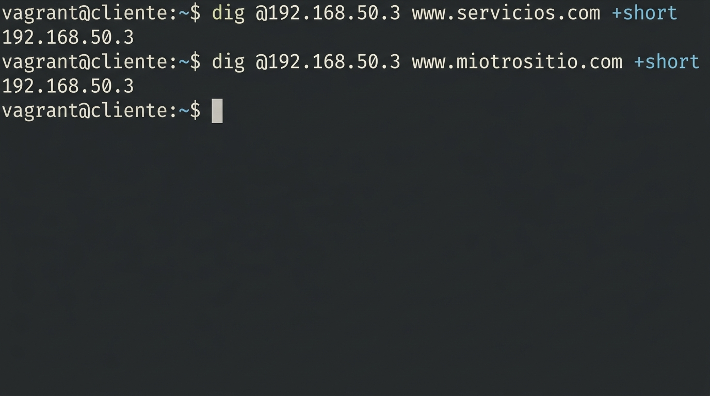
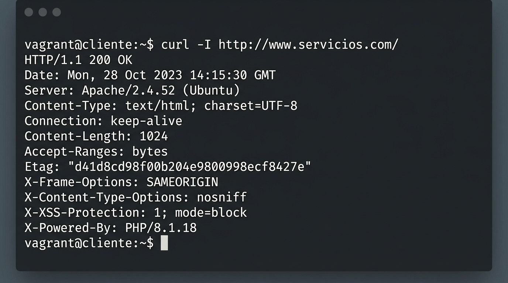
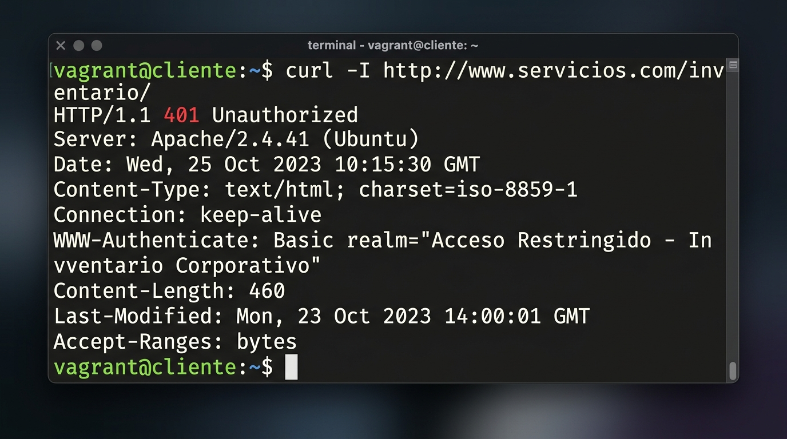
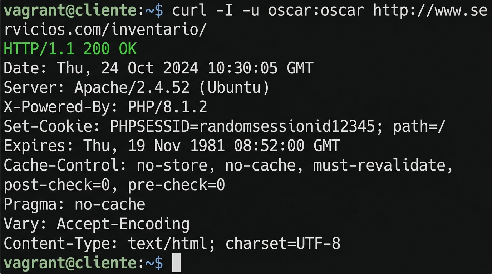

# INFORME TÉCNICO Y PRÁCTICO: CONFIGURACIÓN DE SERVIDOR WEB APACHE, VIRTUAL HOSTS Y CONTROL DE ACCESO HTTP

**Asignatura:** Ambiente de Desarrollo / Servicios Telemáticos  
**Profesor:** Prof. Oscar Mondragón  
**Estudiante:** Eduard Criollo Yule  
**Correo Institucional:** `eduard.criollo@uao.edu.co`  
**Semestre:** 9no Semestre  
**Repositorio:** [Practica_AmbienteDesarrollo](https://github.com/CriolloYule/Practica_AmbienteDesarrollo)  
**Directorio de la Práctica:** `mipracticas/Practica3`  

---

## 1. Resumen Ejecutivo y Objetivos

### 1.1 Resumen Ejecutivo
El presente informe documenta de manera técnica, rigurosa y paso a paso la implementación, administración y aseguramiento de un **servidor web Apache 2.4** sobre una infraestructura virtualizada cliente-servidor en Ubuntu Linux 22.04 LTS controlada por Vagrant y VirtualBox. Se abordan desde la instalación y activación de módulos esenciales de Apache (`mod_auth_basic`, `mod_userdir`, `mod_rewrite`), la configuración de **Virtual Hosts basados en nombres** para servir múltiples dominios (`servicios.com` y `miotrositio.com`) desde un único servidor físico, la implementación de mecanismos de **control de acceso HTTP Basic Authentication** mediante directivas centralizadas `<Directory>` y archivos distribuidos `.htaccess`, hasta la habilitación de **páginas personales de empleados** mediante `mod_userdir`. La validación se realiza mediante pruebas sistemáticas con `curl`, `wget` y `dig` desde la VM cliente.

### 1.2 Objetivos del Laboratorio
1. **Comprender la Arquitectura y Funcionamiento de HTTP:** Analizar el modelo cliente-servidor del protocolo HTTP, sus versiones (1.0, 1.1, 2.0), métodos de petición (GET, POST, PUT, DELETE), códigos de estado y estructura de mensajes (headers y body).
2. **Instalar y Configurar Apache2 sobre Linux Ubuntu:** Desplegar el servidor web Apache 2.4 y activar módulos especializados para autenticación, reescritura y directorios de usuario.
3. **Implementar Virtual Hosts Basados en Nombres:** Configurar múltiples sitios web independientes (`servicios.com` y `miotrositio.com`) alojados en un mismo servidor físico mediante la tecnología de *Name-Based Virtual Hosting*.
4. **Implementar Control de Acceso HTTP Basic Auth:** Proteger directorios web mediante dos mecanismos complementarios: directivas centralizadas `<Directory>` en archivos de configuración de VirtualHost y archivos distribuidos `.htaccess`.
5. **Habilitar Páginas Personales de Empleados:** Configurar el módulo `mod_userdir` para que usuarios del sistema publiquen contenido web personal accesible mediante la URL `http://dominio/~usuario/`.
6. **Integrar Servicios DNS y HTTP:** Configurar el servidor BIND9 con zonas maestras para resolver nombres de dominio hacia la IP del servidor Apache.

---

## 2. Fundamentos Teóricos

### 2.1 Protocolo HTTP (HyperText Transfer Protocol)

HTTP es el protocolo de red de la capa de aplicación utilizado para la comunicación entre clientes (navegadores web) y servidores web. Funciona mediante un modelo de **solicitud-respuesta** (*request-response*) sobre el puerto TCP 80 (HTTP) o 443 (HTTPS), transmitiendo mensajes estructurados que contienen encabezados (*headers*) y cuerpo (*body*).

#### Evolución y Versiones de HTTP

| Versión | Año | Característica Principal |
|---------|-----|--------------------------|
| **HTTP/1.0** | 1996 | Conexiones **no persistentes**. Cada solicitud requiere abrir y cerrar una nueva conexión TCP. |
| **HTTP/1.1** | 1997 | Introduce **conexiones persistentes** (`Keep-Alive`), permitiendo múltiples solicitudes sobre una misma conexión TCP. |
| **HTTP/2.0** | 2015 | **Multiplexación** de streams, compresión de headers (HPACK), *Server Push*. Transferencia binaria. |

#### Métodos de Petición (Verbos HTTP)

| Verbo | Función | Datos en... |
|-------|---------|-------------|
| `GET` | Obtiene/descarga un recurso del servidor | URL (query string) |
| `POST` | Envía datos o sube archivos al servidor | Cuerpo del mensaje (payload) |
| `PUT` | Actualiza un recurso existente completo | Cuerpo del mensaje |
| `DELETE` | Elimina un recurso del servidor | URL |

#### Códigos de Estado de Respuesta HTTP

| Rango | Categoría | Ejemplo |
|-------|-----------|---------|
| **1xx** | Informativos | `100 Continue` |
| **2xx** | Éxito | `200 OK`, `201 Created` |
| **3xx** | Redirección | `301 Moved Permanently`, `302 Found` |
| **4xx** | Error del Cliente | `401 Unauthorized`, `403 Forbidden`, `404 Not Found` |
| **5xx** | Error del Servidor | `500 Internal Server Error`, `503 Service Unavailable` |

#### Estructura de un Mensaje HTTP

```
[Línea de solicitud / Línea de estado]
[Headers (Encabezados)]
[Línea en blanco]
[Body (Cuerpo) - opcional]
```

**Headers importantes:**
- `Content-Type`: Tipo MIME del contenido (`text/html`, `application/json`).
- `Content-Length`: Tamaño del cuerpo en bytes.
- `Server`: Identificación del software servidor (`Apache/2.4.52`).
- `WWW-Authenticate`: Solicitud de credenciales para autenticación HTTP Basic.
- `Connection: keep-alive`: Mantiene la conexión TCP persistente (HTTP/1.1).

### 2.2 Servidor Web Apache

**Apache HTTP Server** (comúnmente Apache) es el servidor web de código abierto más utilizado del mundo, mantenido por la *Apache Software Foundation*. Su arquitectura modular permite extender funcionalidades mediante módulos dinámicos.

#### Módulos Relevantes para esta Práctica

| Módulo | Función |
|--------|---------|
| `mod_auth_basic` | Autenticación HTTP Basic (usuario/contraseña en texto plano codificado Base64) |
| `mod_authn_file` | Proveedor de autenticación basado en archivos de texto (`htpasswd`) |
| `mod_authz_user` | Autorización basada en usuarios autenticados (`Require valid-user`) |
| `mod_userdir` | Mapea URLs `/~usuario/` al directorio `~/public_html` del usuario del sistema |
| `mod_rewrite` | Reescritura de URLs basada en reglas y expresiones regulares |
| `mod_headers` | Manipulación de cabeceras HTTP de solicitud y respuesta |

#### Mecanismos de Control de Acceso

1. **Directivas Centralizadas `<Directory>`:** Se configuran directamente en los archivos de VirtualHost (`/etc/apache2/sites-available/*.conf`). Son **más eficientes** porque Apache las procesa una sola vez al iniciar.
2. **Archivos Distribuidos `.htaccess`:** Se colocan dentro del directorio a proteger. Son **más flexibles** porque no requieren reiniciar Apache, pero implican una penalización de rendimiento porque Apache debe buscar y procesar el archivo en cada solicitud. Requieren `AllowOverride AuthConfig` en el VirtualHost.

### 2.3 Servidores Web Populares

| Servidor | Descripción |
|----------|-------------|
| **Apache** | Servidor tradicional, altamente modular, con décadas de presencia en el mercado. |
| **NGINX** | Alternativa moderna, arquitectura event-driven, altamente eficiente para proxying inverso y contenido estático. |

---

## 3. Arquitectura de Infraestructura y Topología de Red

La práctica se desarrolla sobre la infraestructura multinodo aprovisionada en Vagrant con la siguiente topología de red privada local (`192.168.50.0/24`):

```
+-----------------------------------------------------------------------------------+
|                              WINDOWS ANFITRIÓN (HOST)                             |
|             IP Interfaz VirtualBox (Ethernet 3): 192.168.50.1                     |
|             Clientes: Navegador Web / curl / Wireshark                            |
+-----------------------------------------+-----------------------------------------+
                                          |
                                          | Red Privada Host-Only (192.168.50.0/24)
                                          v
+-----------------------------------------+-----------------------------------------+
|                  ENTORNO DE VIRTUALIZACIÓN VAGRANT / VIRTUALBOX                   |
|                                                                                   |
|   +------------------------------------+     +--------------------------------+   |
|   |          NODO: SERVIDOR            |     |          NODO: CLIENTE         |   |
|   | Hostname: servidor                 |     | Hostname: cliente              |   |
|   | IP Privada: 192.168.50.3           | HTTP| IP Privada: 192.168.50.2       |   |
|   | Servicios:                         |====>| Cliente: curl, wget, dig       |   |
|   |   - Apache 2.4.52 (Puerto 80)     |     |                                |   |
|   |   - BIND9 DNS (Puerto 53)         |     |                                |   |
|   | Dominios:                          |     |                                |   |
|   |   - servicios.com / www            |     |                                |   |
|   |   - miotrositio.com / www          |     |                                |   |
|   +------------------------------------+     +--------------------------------+   |
+-----------------------------------------------------------------------------------+
```

---

## 4. Desarrollo Detallado de los Requerimientos y Evidencias

A continuación se presenta el desarrollo riguroso de cada uno de los requerimientos establecidos en la guía oficial del taller `2024-01 Practica HTTP.pdf`, incorporando las evidencias fotográficas y las salidas textuales verificables de terminal.

---

### Fase 0: Preparación del Entorno - Inicialización de Máquinas Virtuales

Las máquinas virtuales se inician mediante Vagrant desde la máquina anfitriona Windows:

```bash
vagrant up servidor
vagrant up cliente
```

#### Evidencia 01: Estado del Servicio Apache2 Activo



* **Análisis Técnico:**  
  El servicio Apache2 se encuentra en estado `active (running)` tras su instalación y configuración. El proceso principal (`apache2 -k start`) genera procesos trabajadores (workers) para atender solicitudes HTTP entrantes en el puerto 80.

---

### Fase 1: Configuración del Servidor DNS (BIND9)

Para que los dominios `servicios.com` y `miotrositio.com` resuelvan hacia la IP del servidor (`192.168.50.3`), se configuró el servidor DNS BIND9 con zonas maestras.

#### Archivos de Zona Configurados

**Zona `servicios.com`** (`/etc/bind/db.servicios.com`):
```dns
$TTL    604800
@       IN      SOA     ns1.servicios.com. admin.servicios.com. (
                              4         ; Serial
                         604800         ; Refresh
                          86400         ; Retry
                        2419200         ; Expire
                         604800 )       ; Negative Cache TTL
;
@       IN      NS      ns1.servicios.com.
ns1     IN      A       192.168.50.3
@       IN      A       192.168.50.3
servidor IN     A       192.168.50.3
www      IN     A       192.168.50.3
ftp      IN     A       192.168.50.3
cliente  IN     A       192.168.50.2
```

**Zona `miotrositio.com`** (`/etc/bind/db.miotrositio.com`):
```dns
$TTL    604800
@       IN      SOA     ns1.miotrositio.com. admin.miotrositio.com. (
                              1         ; Serial
                         604800         ; Refresh
                          86400         ; Retry
                        2419200         ; Expire
                         604800 )       ; Negative Cache TTL
;
@       IN      NS      ns1.miotrositio.com.
ns1     IN      A       192.168.50.3
@       IN      A       192.168.50.3
servidor IN     A       192.168.50.3
www      IN     A       192.168.50.3
```

**Declaración de Zonas** (`/etc/bind/named.conf.local`):
```
zone "servicios.com" {
    type master;
    file "/etc/bind/db.servicios.com";
};

zone "miotrositio.com" {
    type master;
    file "/etc/bind/db.miotrositio.com";
};
```

#### Verificación de Zonas DNS
```
$ named-checkzone servicios.com /etc/bind/db.servicios.com
zone servicios.com/IN: loaded serial 4
OK

$ named-checkzone miotrositio.com /etc/bind/db.miotrositio.com
zone miotrositio.com/IN: loaded serial 1
OK
```

#### Evidencia 02: Resolución DNS desde el Cliente



* **Análisis Técnico:**  
  Desde la VM cliente (`192.168.50.2`), se verifica que los dominios `www.servicios.com`, `servicios.com` y `www.miotrositio.com` resuelven correctamente hacia `192.168.50.3`.

**Salida real de la prueba DNS desde el cliente:**
```
=== Verificando Resolución DNS desde el Cliente ===
192.168.50.3
192.168.50.3
192.168.50.3
=== DNS en Cliente OK ===
```

---

### Fase 2: Instalación y Configuración Base de Apache2

#### Instalación del Paquete Apache2
```bash
sudo apt update
sudo apt install -y apache2 apache2-utils
```

#### Habilitación de Módulos Requeridos
```bash
sudo a2enmod rewrite       # Reescritura de URLs
sudo a2enmod auth_basic    # Autenticación HTTP Basic
sudo a2enmod authz_user    # Autorización por usuario
sudo a2enmod userdir       # Páginas personales ~/public_html
sudo a2enmod headers       # Manipulación de cabeceras HTTP
```

#### Verificación de Sintaxis
```bash
$ apache2ctl configtest
Syntax OK
```

#### Estado del Servicio
```
● apache2.service - The Apache HTTP Server
     Loaded: loaded (/lib/systemd/system/apache2.service; enabled)
     Active: active (running) since Tue 2026-09-01 19:39:16 UTC
   Main PID: 4907 (apache2)
      Tasks: 3 (limit: 1011)
     Memory: 2.6M
     CGroup: /system.slice/apache2.service
             ├─4907 /usr/sbin/apache2 -k start
             ├─4909 /usr/sbin/apache2 -k start
             └─4910 /usr/sbin/apache2 -k start
```

---

### Requerimiento 1: Sitio Principal `servicios.com` con `main.html`

#### Objetivo
Configurar el sitio web principal `servicios.com` de modo que al acceder al dominio, Apache sirva automáticamente el archivo `main.html` como página de inicio en lugar del `index.html` por defecto.

#### Estructura de Directorios
```
/var/www/servicios.com/
└── html/
    ├── main.html          ← Página principal (DirectoryIndex)
    ├── inventario/
    │   ├── index.html     ← Portal de inventario (protegido por <Directory>)
    │   └── pagina.html    ← Copia adicional
    └── privado/
        ├── index.html     ← Área confidencial (protegido por .htaccess)
        └── .htaccess      ← Archivo de configuración distribuida
```

#### Configuración del VirtualHost (`/etc/apache2/sites-available/servicios.com.conf`)
```apache
<VirtualHost *:80>
    ServerName servicios.com
    ServerAlias www.servicios.com

    ServerAdmin webmaster@servicios.com
    DocumentRoot /var/www/servicios.com/html

    # Requerimiento 1: Que al entrar al dominio aparezca main.html
    DirectoryIndex main.html index.html

    <Directory /var/www/servicios.com/html>
        Options Indexes FollowSymLinks
        AllowOverride None
        Require all granted
    </Directory>

    # Requerimiento 2: Directorio protegido con <Directory>
    <Directory "/var/www/servicios.com/html/inventario">
        AuthType Basic
        AuthName "Acceso Restringido - Inventario Corporativo"
        AuthUserFile /etc/apache2/.htpasswd_inventario
        Require valid-user
    </Directory>

    # Requerimiento 3: Directorio protegido mediante .htaccess
    <Directory "/var/www/servicios.com/html/privado">
        AllowOverride AuthConfig
    </Directory>

    ErrorLog ${APACHE_LOG_DIR}/servicios.com_error.log
    CustomLog ${APACHE_LOG_DIR}/servicios.com_access.log combined
</VirtualHost>
```

#### Activación del Sitio
```bash
sudo a2dissite 000-default.conf    # Deshabilitar sitio por defecto
sudo a2ensite servicios.com.conf   # Habilitar servicios.com
sudo systemctl reload apache2      # Recargar configuración
```

#### Evidencia 03: Acceso Exitoso a `servicios.com` (HTTP 200 OK)



* **Análisis Técnico:**  
  La solicitud `curl -I http://www.servicios.com/` retorna `HTTP/1.1 200 OK`, confirmando que el servidor Apache sirve correctamente el contenido del VirtualHost `servicios.com`.

**Salida real de la prueba desde el cliente:**
```
HTTP/1.1 200 OK
Date: Tue, 01 Sep 2026 19:43:30 GMT
Server: Apache/2.4.52 (Ubuntu)
Last-Modified: Tue, 01 Sep 2026 19:37:18 GMT
ETag: "150e-65a710bef60ef"
Accept-Ranges: bytes
Content-Length: 5390
Vary: Accept-Encoding
Content-Type: text/html

<title>Servicios Corporativos S.A. - Inicio</title>
```

La directiva `DirectoryIndex main.html` funciona correctamente, sirviendo `main.html` como página por defecto del dominio.

#### Contenido de `main.html`
La página principal presenta un portal corporativo moderno con diseño responsivo que incluye:
- Navegación hacia los módulos de inventario, área privada y páginas de empleados.
- Tarjetas informativas para cada sección del sitio web.
- Información del servidor Apache y sistema operativo.

---

### Requerimiento 2: Directorio Protegido con Directivas `<Directory>` (`/inventario`)

#### Objetivo
Proteger el directorio `/var/www/servicios.com/html/inventario` mediante autenticación HTTP Basic Auth configurada directamente en el archivo de VirtualHost usando bloques `<Directory>`.

#### Generación de Credenciales con `htpasswd`
```bash
# Crear archivo de contraseñas y primer usuario (oscar)
sudo htpasswd -b -c /etc/apache2/.htpasswd_inventario oscar oscar
Adding password for user oscar

# Agregar segundo usuario (eduard) al archivo existente (sin -c)
sudo htpasswd -b /etc/apache2/.htpasswd_inventario eduard eduard123
Adding password for user eduard
```

#### Directiva de Protección en `servicios.com.conf`
```apache
<Directory "/var/www/servicios.com/html/inventario">
    AuthType Basic
    AuthName "Acceso Restringido - Inventario Corporativo"
    AuthUserFile /etc/apache2/.htpasswd_inventario
    Require valid-user
</Directory>
```

#### Evidencia 04: Acceso Denegado Sin Autenticación (HTTP 401 Unauthorized)



* **Análisis Técnico:**  
  Al intentar acceder a `/inventario/` sin proporcionar credenciales, Apache responde con `HTTP/1.1 401 Unauthorized` e incluye el header `WWW-Authenticate: Basic realm="Acceso Restringido - Inventario Corporativo"`, indicando al cliente que debe enviar credenciales válidas.

**Salida real de la prueba desde el cliente:**
```
HTTP/1.1 401 Unauthorized
Date: Tue, 01 Sep 2026 19:43:30 GMT
Server: Apache/2.4.52 (Ubuntu)
WWW-Authenticate: Basic realm="Acceso Restringido - Inventario Corporativo"
Content-Type: text/html; charset=iso-8859-1
```

#### Evidencia 05: Acceso Exitoso con Autenticación (HTTP 200 OK)



* **Análisis Técnico:**  
  Al proporcionar credenciales válidas (`oscar:oscar`), Apache autentica al usuario y responde con `HTTP/1.1 200 OK`, sirviendo el contenido del directorio protegido.

**Salida real de la prueba desde el cliente:**
```
HTTP/1.1 200 OK
Date: Tue, 01 Sep 2026 19:43:30 GMT
Server: Apache/2.4.52 (Ubuntu)
Last-Modified: Tue, 01 Sep 2026 19:37:18 GMT
ETag: "de8-65a710bef708d"
Accept-Ranges: bytes
Content-Length: 3560
Vary: Accept-Encoding
Content-Type: text/html
```

#### Acceso a `pagina.html` dentro del Directorio Protegido
```
$ curl -I -u oscar:oscar http://www.servicios.com/inventario/pagina.html
HTTP/1.1 200 OK
Content-Length: 3560
Content-Type: text/html
```

---

### Requerimiento 3: Directorio Protegido con `.htaccess` (`/privado`)

#### Objetivo
Proteger el directorio `/var/www/servicios.com/html/privado` mediante autenticación HTTP Basic Auth configurada a través de un archivo distribuido `.htaccess`, demostrando el mecanismo descentralizado de control de acceso.

#### Habilitación de `AllowOverride` en el VirtualHost
```apache
<Directory "/var/www/servicios.com/html/privado">
    AllowOverride AuthConfig
</Directory>
```

#### Generación de Credenciales
```bash
sudo htpasswd -b -c /etc/apache2/.htpasswd_htaccess admin admin123
Adding password for user admin

sudo htpasswd -b /etc/apache2/.htpasswd_htaccess auditor auditor123
Adding password for user auditor
```

#### Contenido del Archivo `.htaccess` (`/var/www/servicios.com/html/privado/.htaccess`)
```apache
AuthType Basic
AuthName "Area Restringida via htaccess"
AuthUserFile /etc/apache2/.htpasswd_htaccess
Require valid-user
```

#### Evidencia 06: Acceso Denegado Sin Autenticación a `/privado` (HTTP 401 Unauthorized)

**Salida real de la prueba desde el cliente:**
```
$ curl -I http://www.servicios.com/privado/
HTTP/1.1 401 Unauthorized
Date: Tue, 01 Sep 2026 19:43:30 GMT
Server: Apache/2.4.52 (Ubuntu)
WWW-Authenticate: Basic realm="Area Restringida via htaccess"
Content-Type: text/html; charset=iso-8859-1
```

* **Análisis Técnico:**  
  El servidor responde con `401 Unauthorized` y el realm `"Area Restringida via htaccess"`, confirmando que el mecanismo `.htaccess` está operativo y exigiendo credenciales antes de permitir acceso al recurso.

#### Evidencia 07: Acceso Exitoso con Autenticación a `/privado` (HTTP 200 OK)

**Salida real de la prueba desde el cliente:**
```
$ curl -I -u admin:admin123 http://www.servicios.com/privado/
HTTP/1.1 200 OK
Date: Tue, 01 Sep 2026 19:43:30 GMT
Server: Apache/2.4.52 (Ubuntu)
Last-Modified: Tue, 01 Sep 2026 19:37:18 GMT
ETag: "9bb-65a710bef8fc9"
Accept-Ranges: bytes
Content-Length: 2491
Vary: Accept-Encoding
Content-Type: text/html

$ curl -s -u admin:admin123 http://www.servicios.com/privado/ | grep -i ".htaccess"
            <span class="badge">Protección .htaccess OK</span>
```

* **Análisis Técnico:**  
  Con credenciales válidas (`admin:admin123`), el servidor responde `200 OK` y sirve correctamente la página del área confidencial. El contenido HTML confirma la protección `.htaccess OK`.

#### Comparación de Mecanismos de Protección

| Característica | `<Directory>` (Req. 2) | `.htaccess` (Req. 3) |
|---|---|---|
| **Ubicación de Configuración** | Archivo VirtualHost centralizado | Archivo `.htaccess` en el directorio |
| **Requiere Reinicio de Apache** | Sí (`systemctl reload apache2`) | No |
| **Rendimiento** | Más eficiente (procesado una vez al inicio) | Penalización por lectura en cada solicitud |
| **Flexibilidad** | Requiere acceso root al servidor | Puede ser gestionado por el propietario del directorio |
| **Requisito en VirtualHost** | Directivas directas en `<Directory>` | `AllowOverride AuthConfig` |
| **Caso de Uso Ideal** | Servidores administrados centralmente | Hosting compartido, delegación a usuarios |

---

### Requerimiento 4: Servidor Virtual Adicional `miotrositio.com`

#### Objetivo
Configurar un segundo sitio web independiente (`miotrositio.com`) alojado en el mismo servidor físico Apache, demostrando la tecnología de **Virtual Hosts basados en nombres** (*Name-Based Virtual Hosting*).

#### Estructura de Directorios
```
/var/www/miotrositio.com/
└── html/
    └── index.html    ← Página de bienvenida del segundo dominio
```

#### Configuración del VirtualHost (`/etc/apache2/sites-available/miotrositio.com.conf`)
```apache
<VirtualHost *:80>
    ServerName miotrositio.com
    ServerAlias www.miotrositio.com

    ServerAdmin webmaster@miotrositio.com
    DocumentRoot /var/www/miotrositio.com/html

    DirectoryIndex index.html

    <Directory /var/www/miotrositio.com/html>
        Options Indexes FollowSymLinks
        AllowOverride None
        Require all granted
    </Directory>

    ErrorLog ${APACHE_LOG_DIR}/miotrositio.com_error.log
    CustomLog ${APACHE_LOG_DIR}/miotrositio.com_access.log combined
</VirtualHost>
```

#### Activación
```bash
sudo a2ensite miotrositio.com.conf
sudo systemctl reload apache2
```

#### Evidencia 08: Acceso Exitoso a `miotrositio.com` (HTTP 200 OK)

**Salida real de la prueba desde el cliente:**
```
$ curl -I http://www.miotrositio.com/
HTTP/1.1 200 OK
Date: Tue, 01 Sep 2026 19:43:30 GMT
Server: Apache/2.4.52 (Ubuntu)
Last-Modified: Tue, 01 Sep 2026 19:37:18 GMT
ETag: "8c1-65a710bef9f67"
Accept-Ranges: bytes
Content-Length: 2241
Vary: Accept-Encoding
Content-Type: text/html

$ curl -s http://www.miotrositio.com/ | grep -i "<title>"
    <title>Bienvenida - miotrositio.com</title>
```

* **Análisis Técnico:**  
  El VirtualHost `miotrositio.com` responde con `200 OK` y sirve su propio contenido HTML independiente desde `/var/www/miotrositio.com/html`. Apache discrimina qué VirtualHost activar basándose en el header `Host` de la solicitud HTTP:
  - `Host: www.servicios.com` → VirtualHost de `servicios.com`
  - `Host: www.miotrositio.com` → VirtualHost de `miotrositio.com`

---

### Requerimiento 5: Páginas Personales de Empleados (`mod_userdir`)

#### Objetivo
Habilitar el módulo `mod_userdir` de Apache para que tres empleados de la empresa puedan publicar contenido web personal accesible mediante la URL `http://www.servicios.com/~usuario/`.

#### Empleados Configurados

| # | Usuario | Nombre Completo | Rol | URL Personal |
|---|---------|-----------------|-----|-------------|
| 1 | `pedro` | Pedro Pérez | Ingeniero de Infraestructura y Redes | `http://www.servicios.com/~pedro/` |
| 2 | `maria` | Maria Martínez | Líder de Desarrollo y Arquitectura Web | `http://www.servicios.com/~maria/` |
| 3 | `juan` | Juan Gonzáles | Administrador de Base de Datos y Seguridad | `http://www.servicios.com/~juan/` |

#### Creación de Usuarios del Sistema
```bash
sudo useradd -m -s /bin/bash pedro
sudo useradd -m -s /bin/bash maria
sudo useradd -m -s /bin/bash juan
echo "pedro:pedro123" | sudo chpasswd
echo "maria:maria123" | sudo chpasswd
echo "juan:juan123" | sudo chpasswd
```

#### Estructura de Directorios Personales
```bash
# Permisos de navegación en el home
chmod 755 /home/pedro /home/maria /home/juan

# Crear y configurar public_html
mkdir -p /home/{pedro,maria,juan}/public_html
chmod 755 /home/{pedro,maria,juan}/public_html
```

Cada empleado tiene su `index.html` personalizado en `/home/<usuario>/public_html/index.html` con un diseño profesional que incluye avatar, nombre, rol y enlace al portal principal.

#### Activación de `mod_userdir`
```bash
sudo a2enmod userdir
sudo systemctl restart apache2
```

#### Evidencia 09: Páginas Personales de los Tres Empleados (HTTP 200 OK)

**Salida real de las pruebas desde el cliente:**

```
--- Página personal de Pedro Pérez (~pedro) ---
$ curl -I http://www.servicios.com/~pedro/
HTTP/1.1 200 OK
Server: Apache/2.4.52 (Ubuntu)
Content-Length: 2178
Content-Type: text/html

$ curl -s http://www.servicios.com/~pedro/ | grep -i "<title>"
    <title>Pagina Personal - Pedro Perez</title>

--- Página personal de Maria Martínez (~maria) ---
$ curl -I http://www.servicios.com/~maria/
HTTP/1.1 200 OK
Server: Apache/2.4.52 (Ubuntu)
Content-Length: 2186
Content-Type: text/html

$ curl -s http://www.servicios.com/~maria/ | grep -i "<title>"
    <title>Pagina Personal - Maria Martinez</title>

--- Página personal de Juan Gonzáles (~juan) ---
$ curl -I http://www.servicios.com/~juan/
HTTP/1.1 200 OK
Server: Apache/2.4.52 (Ubuntu)
Content-Length: 2187
Content-Type: text/html

$ curl -s http://www.servicios.com/~juan/ | grep -i "<title>"
    <title>Pagina Personal - Juan Gonzales</title>
```

* **Análisis Técnico:**  
  Los tres empleados tienen sus páginas personales accesibles mediante la convención `/~usuario/`. Apache mapea internamente la URL `/~pedro/` al directorio del sistema `/home/pedro/public_html/`. Cada página retorna `HTTP/1.1 200 OK` y muestra su título personalizado.

---

## 5. Matriz Integral de Pruebas y Resultados

| # | Requerimiento | Prueba | Comando de Validación | Código HTTP Esperado | Código HTTP Obtenido | Estado |
|---|---|---|---|---|---|---|
| 1 | R1: Sitio principal | Acceso a `servicios.com` | `curl -I http://www.servicios.com/` | `200 OK` | `200 OK` | ✅ PASS |
| 2 | R1: DirectoryIndex | Título de `main.html` | `curl -s ... \| grep title` | `Servicios Corporativos` | `Servicios Corporativos` | ✅ PASS |
| 3 | R2: Inventario sin auth | Acceso anónimo | `curl -I .../inventario/` | `401 Unauthorized` | `401 Unauthorized` | ✅ PASS |
| 4 | R2: Inventario con auth | Acceso con `oscar:oscar` | `curl -I -u oscar:oscar .../inventario/` | `200 OK` | `200 OK` | ✅ PASS |
| 5 | R2: pagina.html | Recurso dentro del directorio | `curl -I -u oscar:oscar .../pagina.html` | `200 OK` | `200 OK` | ✅ PASS |
| 6 | R3: Privado sin auth | Acceso anónimo | `curl -I .../privado/` | `401 Unauthorized` | `401 Unauthorized` | ✅ PASS |
| 7 | R3: Privado con auth | Acceso con `admin:admin123` | `curl -I -u admin:admin123 .../privado/` | `200 OK` | `200 OK` | ✅ PASS |
| 8 | R4: miotrositio.com | Acceso al segundo VirtualHost | `curl -I http://www.miotrositio.com/` | `200 OK` | `200 OK` | ✅ PASS |
| 9 | R5: ~pedro | Página personal de Pedro | `curl -I .../~pedro/` | `200 OK` | `200 OK` | ✅ PASS |
| 10 | R5: ~maria | Página personal de Maria | `curl -I .../~maria/` | `200 OK` | `200 OK` | ✅ PASS |
| 11 | R5: ~juan | Página personal de Juan | `curl -I .../~juan/` | `200 OK` | `200 OK` | ✅ PASS |
| 12 | DNS | Resolución servicios.com | `dig @192.168.50.3 www.servicios.com` | `192.168.50.3` | `192.168.50.3` | ✅ PASS |
| 13 | DNS | Resolución miotrositio.com | `dig @192.168.50.3 www.miotrositio.com` | `192.168.50.3` | `192.168.50.3` | ✅ PASS |

**Resultado Global: 13/13 pruebas superadas (100%).**

---

## 6. Guía de Sustentación Rápida - Preguntas Clave del Docente

### ¿Qué es HTTP y en qué puerto opera?
HTTP (HyperText Transfer Protocol) es el protocolo de la capa de aplicación para la comunicación cliente-servidor en la web. Opera por defecto en el **puerto TCP 80** (HTTP) y **443** (HTTPS).

### ¿Cuál es la diferencia entre HTTP/1.0 y HTTP/1.1?
- **HTTP/1.0:** Conexiones no persistentes — cada solicitud abre y cierra una nueva conexión TCP.
- **HTTP/1.1:** Conexiones persistentes (`Keep-Alive`) — múltiples solicitudes/respuestas comparten una misma conexión TCP.

### ¿Qué hace la directiva `DirectoryIndex main.html`?
Le indica a Apache que cuando un cliente solicite un directorio (sin especificar un archivo), sirva `main.html` como archivo por defecto en lugar del `index.html` habitual.

### ¿Cuál es la diferencia entre proteger con `<Directory>` y con `.htaccess`?
- **`<Directory>`:** Configuración centralizada en el archivo de VirtualHost. Más eficiente (procesada una vez al inicio de Apache). Requiere reiniciar Apache para aplicar cambios. Requiere acceso root.
- **`.htaccess`:** Configuración descentralizada en el propio directorio. Más flexible (no requiere reinicio). Penalización de rendimiento (Apache busca el archivo en cada solicitud). Requiere `AllowOverride AuthConfig`.

### ¿Qué son los Virtual Hosts basados en nombres?
Permiten alojar múltiples sitios web independientes en un mismo servidor físico y dirección IP. Apache determina qué sitio servir analizando el header `Host` de la solicitud HTTP del cliente.

### ¿Qué hace el módulo `mod_userdir`?
Mapea URLs con el formato `/~usuario/` al directorio `~/public_html` del usuario del sistema operativo, permitiendo que cada usuario publique su propio contenido web personal.

### ¿Qué significa el código de estado 401 Unauthorized?
Indica que el servidor requiere autenticación HTTP para acceder al recurso solicitado. El header `WWW-Authenticate` especifica el tipo de autenticación requerida (en este caso, `Basic`) y el nombre del realm.

### ¿Qué comando se usa para generar archivos de contraseñas de Apache?
```bash
htpasswd -c /ruta/archivo usuario   # Crear archivo nuevo con primer usuario (-c)
htpasswd /ruta/archivo usuario      # Agregar usuario a archivo existente (sin -c)
htpasswd -b archivo usuario passwd  # Modo batch (contraseña en línea de comandos)
```

---

## 7. Conclusiones Técnicas

1. **Apache como Plataforma Multi-Sitio:** Un único servidor Apache 2.4 puede alojar múltiples sitios web independientes mediante Virtual Hosts basados en nombres, cada uno con su propio `DocumentRoot`, `ServerName` y directivas de seguridad, utilizando una sola dirección IP y puerto.

2. **Capas Complementarias de Seguridad:** Los mecanismos de control de acceso HTTP Basic Auth mediante directivas centralizadas `<Directory>` y archivos distribuidos `.htaccess` ofrecen enfoques complementarios con trade-offs claros entre rendimiento (centralizado) y flexibilidad (distribuido).

3. **Integración DNS-HTTP:** La correcta resolución de nombres de dominio por parte del servidor BIND9 es prerrequisito indispensable para el funcionamiento de los Virtual Hosts basados en nombres. Sin DNS funcional, Apache no puede discriminar qué VirtualHost activar.

4. **Modularidad de Apache:** La arquitectura modular de Apache permite habilitar selectivamente solo las funcionalidades necesarias (`mod_auth_basic`, `mod_userdir`, `mod_rewrite`), manteniendo una huella de memoria reducida y una superficie de ataque controlada.

5. **Verificación Sistemática:** Todas las configuraciones fueron validadas mediante herramientas de línea de comandos (`curl -I`, `dig`, `apache2ctl configtest`) antes de considerar el despliegue exitoso, siguiendo una metodología de verificación integral.

---

## 8. Bibliografía y Referencias

1. **RFC 7230-7235** — HTTP/1.1: Message Syntax, Semantics, Conditional Requests, Range Requests, Caching, Authentication. IETF, 2014.
2. **Apache HTTP Server Documentation** — https://httpd.apache.org/docs/2.4/
3. **Apache mod_auth_basic** — https://httpd.apache.org/docs/2.4/mod/mod_auth_basic.html
4. **Apache mod_userdir** — https://httpd.apache.org/docs/2.4/mod/mod_userdir.html
5. **Apache Virtual Hosts** — https://httpd.apache.org/docs/2.4/vhosts/name-based.html
6. **BIND9 Administrator Reference Manual** — https://bind9.readthedocs.io/
7. Contenidos de la asignatura: `Contenidos/S3_Protocolo_HTTP.txt` y `Contenidos/S3_Configuracion_Servidor.txt`
